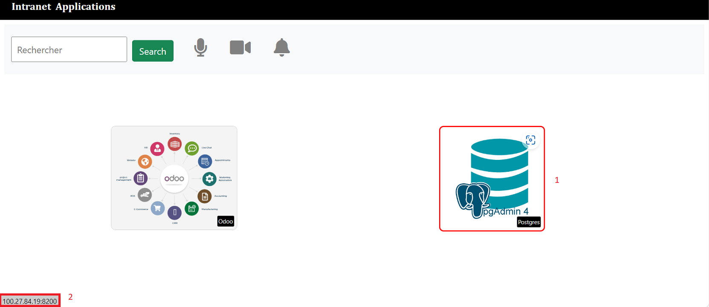

# PROJET FINAL DEVOPS


**Le Projet fil rouge** est mon deuxième projet de fin de formation Devops. Son objectif est de faire la démonstration pratique et théorique des éléments techniques appris durant le cursus DevOps à savoir **Docker, gitlab-ci, jenkins, Terraform, Ansible et Kubernetes**

# Table des Matières

- [**PROJET FINAL DEVOPS.**](#projet-final-devops)
  - [**INTRODUCTION**](#introduction)
      - [odoo](#odoo)
      - [pgadmin](#pgadmin)
      - [Liens utiles](#liens-utiles)
  - [**PARTIE 1: Conteneurisation de l’application web**](#partie-1-conteneurisation-de-lapplication-web)
    - [a. Création du projet fil rouge](#a-création-du-projet-fil-rouge)
    - [b. Écriture du Dockerfile](#b-ecriture-du-dockerfile)
    - [c. Build et Test](#c-build-et-test)
    - [d. Push vers DockerHub](#d-push-vers-dockerhub)
  - [**PARTIE 2: Mise en place d'un pipeline CI/CD à l'aide de Jenkins et Terraform**](#partie-2-mise-en-place-dun-pipeline-cicd-à-laide-de-jenkins-et-terraform)
    - [a - Mise en place de notre infrastructure](#a-mise-en-place-de-notre-infrastructure)
    - [b - Mise en place du pipeline](#b-mise-en-place-du-pipeline)
    - [c - Customisation de la conteneurisation](#c-customisation-de-la-conteneurisation)
  - [**PARTIE 3: Déploiement des différentes applications dans un cluster Kubernetes**](#partie-3-déploiement-des-différentes-applications-dans-un-cluster-kubernetes)
    - [a - Architecture](#a-architecture)
    - [b - Identification des Ressources](#b-identification-des-ressources)
    - [c - Installation de Kubernetes](#c-installation-de-kubernetes)
    - [d - Mise en place du pipeline CI/CD ](#d-mise-en-place-du-pipeline-cicd)
  - [**CONCLUSION**](#conclusion)

## INTRODUCTION 

La société **IC GROUP** dans laquelle vous travaillez en tant qu’ingénieur Devops souhaite mettre sur pied un **site web vitrine** devant permettre d’accéder à ses 02 applications phares qui sont :  

1. Odoo 
2. pgAdmin 
#### odoo

Odoo est distribué en version communautaire et Enterprise. ICGROUP souhaite avoir la main sur le code et apporter ses propres modifications et customisations. Ainsi, l'entreprise a opté pour l’édition communautaire.  Plusieurs versions de Odoo sont disponibles et celle retenue est la version ``13.0``, car elle intègre un système de LMS (Learning Management System) qui sera utilisé pour publier les formations en internes et ainsi diffuser plus facilement l’information.  

#### pgadmin
**pgAdmin** devra être utilisée pour administrer de façon graphique la base de données PostgreSQL, qui est un composant essentiel au fonctionnement de odoo. 
Le site web vitrine a été conçu par l’équipe de développeurs de l’entreprise et les fichiers y relatifs se trouvent dans le repo suivant: [ https://github.com/sadofrazer/ic-webapp.git ](https://github.com/sadofrazer/ic-webapp.git). Il est de votre responsabilité de conteneuriser cette application tout en permettant la saisie des différentes URL des applications (Odoo et pgadmin) par le biais des variables d’environnement. 

Ci-dessous un aperçu du site vitrine attendu. 


----

**NB:** L’image créée devra permettre de lancer un conteneur permettant d’héberger ce site web et ayant les liens adéquats permettant d’accéder aux applications internes.

# PARTIE 1: Conteneurisation de l’application web
Voici les étapes à suivre pour la conteneurisation de cette application:

1) L'image de base sera ```python:3.6-alpine```
2) Définir le répertoire `/opt` comme répertoire de travail 
3) Installer le module Flask version 1.1.2 à l’aide de `pip install flask==1.1.2`
4) Exposer le port `8080` qui est celui utilisé par défaut par l'application
5) Créer les variables d’environnement `ODOO_URL` et `PGADMIN_URL` afin de permettre la définition des url applicatives lors du lancement du conteneur
6) Lancer l’application `app.py` dans le `ENTRYPOINT` grâce à la commande `python`

Une fois le Dockerfile crée, buildez l'image et lancer un conteneur de test permettant d’aller sur les sites web officiels de chacune de ces applications ( les sites web officiels sont fournis ci-dessus). 

### Nom de l'artefact et registre utilisé
Une fois le test terminé, supprimez le conteneur de test et poussez votre image sur votre registre Docker hub. L'image finale devra se nommer comme suit:

- **Nom:**  ``ic-webapp``   
- **Tag:** ``1.0``  
- **Nom du conteneur de test:** ``test-ic-webapp``

### a. Création du Projet fil rouge
Nous allons commencer par la création du Projet sur **github.com** pour ensuite le cloner localement.
Pour cela il faut suivre ces étapes: **repositories** -> **New** -> **Repository name** et renseigner les informations demandées.


---
- clonage du projet en local
```
$ git clone https://github.com/gbaneassouman/projet-fil-rouge-with-jenkins.git
```
```
$ cd projet-fil-rouge-with-jenkins && mkdir -p src
```
Le dossier `src` est le dossier qui va contenir l'ensemble des codes

### b. Écriture du Dockerfile 
- Création du Dockerfile
```
projet-fil-rouge-with-jenkins$ touch src/Dockerfile 
```

```
FROM python:3.6-alpine
LABEL maintener="GBANE Assouman"
LABEL email="gbane.assouman@gmail.com"
WORKDIR /opt
RUN pip install flask==1.1.2
COPY ./app/ /opt/
EXPOSE 8080
ENV ODOO_URL='https://www.odoo.com/'
ENV PGADMIN_URL='https://www.pgadmin.org/'
ENTRYPOINT ["python","app.py"]
```
*NB: Le code source a été rassemblé dans le dossier **app***
### c. Build et Test

- Build
```
$ docker build -t ic-webapp:1.0 .

```
```
$ docker run --name test-ic-webapp -d -p 4444:8080 ic-webapp:1.0 
2033634663fe21cfa71557b2b16a2dd5efc8828e5cbe1adfede40cc78fd9927c
```
```
$ docker ps -a|grep -i "test-ic-webapp"
2033634663fe   ic-webapp:1.0                       "python app.py"          12 seconds ago      Up 11 seconds                   0.0.0.0:4444->8080/tcp, :::4444->8080/tcp              test-ic-webapp
```
- Test 


---

### d. Push vers Dockerhub
- Procédons d'abord à l'arrêt puis à la supression du conteneur
```
$ docker stop test-ic-webapp 
test-ic-webap
```
```
$ docker rm test-ic-webapp 
test-ic-webapp
```
```
$ docker tag ic-webapp:1.0 openlab89/ic-webapp:1.0
```
```
$ docker push openlab89/ic-webapp:1.0 
The push refers to repository [docker.io/openlab89/ic-webapp]
cb85cd2e3be1: Pushed 
81c97900e352: Pushed 
3156423bd38f: Mounted from library/python 
efa76becf38b: Mounted from library/python 
671e3248113c: Mounted from library/python 
1965cfbef2ab: Mounted from library/python 
8d3ac3489996: Mounted from library/python 
1.0: digest: sha256:b18bc5973a28538507f2cdc494f0e15ec905faed6f4ea672c54f33b5acfc22f9 size: 1789
```
- **Résultat**


---

# PARTIE 2: Mise en place d'un pipeline CI/CD à l'aide de Jenkins et Terraform


---

## a. Mise en place de notre infrastructure
Pour cette partie, on aura besoin de 3 serveurs hébergés dans le cloud de `AWS`, dont les rôles seront les suivants:

  1) **Serveur 1**, ``(AWS, t2.medium)``: Serveur de JENKINS
  2) **Serveur 2**, ``(AWS, t2.micro)`` : Serveur de STAGING 
  3) **Serveur 3**, ``(AWS, t2.micro)`` : Serveur de PROD 

Le choix du cloud provider importe peu (AWS, AZURE ou autres ...)
> :warning: Le serveur 1 (**Jenkins**) sera créé par vos soins pour les besoins de CI. Il devra être rattaché à votre compte `Github` pour pour que votre pipeline se lance automatiquement . Quant aux deux autres, il seront créé automatiquement par le pipeline, via l'outil `terraform`.

>NB: Pour des raisons de performances constatées lors des déploiements nous  n'utilseront que des instances `t2.medium`

### a.1 - Structuration du code terraform 
Dans le but de dynamiser notre déploiement nous allons écrire un module `terraform` pour la création de nos serveurs de `staging` de `jenkins` et de `prod`.

Ce module se sera modifié pour intégrer l'installation de `terraform` et de `ansible`  dans le déploiement du serveur `jenkins` à l'aide d'un `remote-exec`

il aura les caractéristiques suivantes:
- **image**: `ubuntu-bionic-18.04`
- **région**: `us-east-1`
- il sera attachée à une `ebs`, une ip publique `eip` et security group `sg`

Nous allons aussi créer 03 dossiers qui vont utiliser le module pour déployer les instances, ces dossiers sont:
- `staging` : pour l'instance de staging
- `prod` : pour l'instances de prod
- `jenkins`: pour l'instances de jenkins

### a.2 - Écriture des modules

Procédons à la création du module ec2module.
```
$ mkdir -p terraform/{files,modules,staging,prod,jenkins}
$ mkdir -p terraform/modules/ec2module
$ touch main.tf outputs.tf variables.tf backend.tf
$ cp main.tf outputs.tf variables.tf modules/ec2module/
$ cp main.tf variables.tf backend.tf staging/
$ cp main.tf variables.tf backend.tf prod/
$ mv variables.tf main.tf outputs.tf jenkins/
```

### Structure des modules

```
.
├── files
│   ├── devops-gbane.pem
│   └── infos_ec2.txt
├── jenkins
│   ├── backend.tf
│   ├── files
│   │   └── infos_ec2.txt
│   ├── install.sh
│   ├── main.tf
│   └── variables.tf
├── modules
│   └── ec2module
│       ├── main.tf
│       ├── outputs.tf
│       └── variables.tf
├── prod
│   ├── backend.tf
│   ├── main.tf
│   └── variables.tf
└── staging
    ├── backend.tf
    ├── main.tf
    └── variables.tf

11 directories, 20 files
```

### Rôles des dossiers et fichiers
- `jenkins` : le module de jenkins, c'est aussi dans ce dossier que les commandes **terraform** pour la création du serveur de jenkins seront executées.
- ```staging``` : le module de staging, il fera appel au module ec2module , c'est aussi dans ce dossier que les commandes **terraform** pour la création du serveur de staging seront executées.
- `prod` : le module de prod, c'est aussi dans ce dossier que les commandes **terraform** pour la création du serveur de prod seront executées.

- `modules/ec2module` : module de l'instance `ec2` c'est ici que seront définies les informations sur l'instance

- `main.tf` : contiendra la configuration principale de nos modules ainsi que les variables à surcharger
- `outputs.tf` : contient les valeurs de sortie ,il expose des informations que d'autres configurations `Terraform` peuvent utiliser. 

- `variables.tf` : contiendra les valeurs  de variables des modules. Lorsqu'un module est utilisé par d'autres, les variables seront configurées comme arguments dans le bloc `module`. 

- `backend.tf` : Terraform doit stocker l'état de l'infrastructure et des configurations. Cet  état est utilisé par Terraform pour mapper les ressources du monde réel à la configuration, suivre les métadonnées et améliorer les performances de l' infrastructure. Cet état est stocké par défaut dans un fichier local nommé `« terraform.tfstate »`, mais il est recommandé de le stocker dans le Cloud pour le versionner, le chiffrer et le partager en toute sécurité avec d'autres personnes.

## Écriture des modules

###  1 - Le module ec2module
Éditons nos 03 scripts `main.tf`, `outputs.tf` et `variables.tf` qui se trouvent dans le répertoire **ec2module**

```
├── ec2module
│   ├── main.tf
│   ├── outputs.tf
│   └── variables.tf
```
**1.a - modules/ec2module/main.tf**

Dans ce fichier nous avons déclaré une **data source** `data` et 03 `resources`.

- la `data` source va définir l'image à utiliser pour installer nos instances.
- les `resources` vont definir le type d'instance `ec2`, l'ip publique `eip` et la security group `sg` avec les ports à ouvrir.

>NB: On aurait pu créer un module pour chaque resources (`ec2`, `eip` et `sg`) et les appeler comme le module `ec2module`

- **1.a.1 contenu du script modules/ec2module/main.tf pour la prod et le staging**
```
data "aws_ami" "app_ami" {
  most_recent = true
  owners      = ["099720109477"] # Canonical
  filter {
    name   = "name"
    values = ["ubuntu/images/hvm-ssd/ubuntu-bionic-18.04-amd64-server-*"]
  }
  filter {
    name   = "virtualization-type"
    values = ["hvm"]
  }
}

resource "aws_instance" "projet_fil_rouge" {
  ami             = data.aws_ami.app_ami.id
  instance_type   = var.instancetype
  key_name        = var.aws_key_name
  tags            = var.aws_common_tag
  security_groups = ["${var.aws_sg_name}"]
  
  root_block_device {
    delete_on_termination = true
  }
}

resource "aws_eip" "lb" {
  instance = aws_instance.projet_fil_rouge.id
  domain   = "vpc"
  tags = var.aws_eip_tag

  provisioner "local-exec" {
    command =  "echo ${aws_eip.lb.public_ip} >> ../${var.deploy_environment}/files/infos_ec2.txt"
  }
}

resource "aws_security_group" "allow_http_https_ssh" {
  name        = var.aws_sg_name
  description = "Allow HTTP inbound traffic"

  ingress {
    description      = "Webapp Access"
    from_port        = 8080
    to_port          = 8080
    protocol         = "tcp"
    cidr_blocks      = ["0.0.0.0/0"]
    ipv6_cidr_blocks = ["::/0"]
  }

  ingress {
    description      = "Pgadmin Access"
    from_port        = 8081
    to_port          = 8081
    protocol         = "tcp"
    cidr_blocks      = ["0.0.0.0/0"]
    ipv6_cidr_blocks = ["::/0"]
  }

  ingress {
    description      = "Odoo Access"
    from_port        = 8069
    to_port          = 8069
    protocol         = "tcp"
    cidr_blocks      = ["0.0.0.0/0"]
    ipv6_cidr_blocks = ["::/0"]
  }

  ingress {
    description      = "SSH from VPC"
    from_port        = 22
    to_port          = 22
    protocol         = "tcp"
    cidr_blocks      = ["0.0.0.0/0"]
    ipv6_cidr_blocks = ["::/0"]
  }

  egress {
    from_port        = 0
    to_port          = 0
    protocol         = "-1"
    cidr_blocks      = ["0.0.0.0/0"]
    ipv6_cidr_blocks = ["::/0"]
  }

  tags = var.aws_sg_tag
}
```
>NB: Dans la resource `eip` on va exécuter un `local_exec` `provisioner` pour récuperer l'adresse ip publique dans le fichier `infos_ec2.txt`. Ce fichier sera utilisé utérieurement par le `pipeline` pour déployer les applications.

**Description**

- `provider` : permet de renseigner la configuration du cloud provider en specifiant la région et les paramètres de connexion  l'`access_key` et le `secret_key` .

- `data` : determine l'image à installer sur l'instance

- `aws_instance` : permet de créer l'instance en fournissant les informations ci-dessous:
  - `ami` : l'image à récuperer à partir de la ressource `data` 
  - `instance_type` : le type d'instance fournit par - `variables.tf`
  - `key_name` : le nom de la clé ssh 
  - `security_groups` : associe l'instance au groupe de securité  `aws_security_group` 
  - `provisioner` : permet de recupérer l'adresse ip publique de l'instance dans le fichier files/infos_ec2.txt. cette action est exécutée sur la machine exécutant terraform
   - `root_block_device`:  permet de détruire le volume associé automatiquement à la destruction de l'instance.
- `aws_eip` : associe une adresse ip publique à l'instance qui lui sera dédiée
- `aws_security_group` : permet d'ouvrir les ports `8080` ,`8081`,`8069` et `22` et d'autoriser le trafic sortant sur l'instance.

- **1.a.2 contenu du modules/ec2module/main.tf modifié pour jenkins**

```
data "aws_ami" "app_ami" {
  most_recent = true
  owners      = ["099720109477"] # Canonical
  filter {
    name   = "name"
    values = ["ubuntu/images/hvm-ssd/ubuntu-bionic-18.04-amd64-server-*"]
  }
  filter {
    name   = "virtualization-type"
    values = ["hvm"]
  }
}

resource "aws_instance" "projet_fil_rouge" {
  ami             = data.aws_ami.app_ami.id
  instance_type   = var.instancetype
  key_name        = var.aws_key_name
  tags            = var.aws_common_tag
  security_groups = ["${var.aws_sg_name}"]

  provisioner "file" {
    source      = "install.sh"
    destination = "/home/${var.username}/install.sh"

    connection {
    type     = "ssh"
    user     = "${var.username}"
    private_key = file("../files/${var.aws_key_name}.pem")
    host     = "${self.public_ip}"
  }
  }

  provisioner "remote-exec" {
    inline = [ 
      "cd /home/${var.username}",
      "sudo chmod +x install.sh",
      "sudo ./install.sh"
    ]

    connection {
    type     = "ssh"
    user     = "${var.username}"
    private_key = file("../files/${var.aws_key_name}.pem")
    host     = "${self.public_ip}"
  }
  }

  root_block_device {
    delete_on_termination = true
  }
}

resource "aws_eip" "lb" {
  instance = aws_instance.projet_fil_rouge.id
  domain   = "vpc"
  tags = var.aws_eip_tag
  
  provisioner "local-exec" {
    command =  "echo ${aws_eip.lb.public_ip} >> files/infos_ec2.txt"
  }
}

resource "aws_security_group" "allow_http_https_ssh" {
  name        = var.aws_sg_name
  description = "Allow HTTP inbound traffic"

  ingress {
    description      = "Jenkins Access"
    from_port        = 8080
    to_port          = 8080
    protocol         = "tcp"
    cidr_blocks      = ["0.0.0.0/0"]
    ipv6_cidr_blocks = ["::/0"]
  }

  ingress {
    description      = "http Access"
    from_port        = 80
    to_port          = 80
    protocol         = "tcp"
    cidr_blocks      = ["0.0.0.0/0"]
    ipv6_cidr_blocks = ["::/0"]
  }

  ingress {
    description      = "https Access"
    from_port        = 443
    to_port          = 443
    protocol         = "tcp"
    cidr_blocks      = ["0.0.0.0/0"]
    ipv6_cidr_blocks = ["::/0"]
  }

  ingress {
    description      = "SSH from VPC"
    from_port        = 22
    to_port          = 22
    protocol         = "tcp"
    cidr_blocks      = ["0.0.0.0/0"]
    ipv6_cidr_blocks = ["::/0"]
  }

  egress {
    from_port        = 0
    to_port          = 0
    protocol         = "-1"
    cidr_blocks      = ["0.0.0.0/0"]
    ipv6_cidr_blocks = ["::/0"]
  }

  tags = var.aws_sg_tag
}
```
- `provisioner` : permet de copier et d'exécuter le script install.sh sur la machine distante

>NB: Le module modifié pour jenkins copie le script `install.sh` et l'exécute sur le serveur jenkins, il ouvre aussi les ports `80`,`443`,`22` et `8080` et d'autoriser le traffic sortant

- **1.c - modules/ec2module/variables.tf**

```
variable "instancetype" {
  type        = string
  description = "definir le type de l'instance"
  default     = "t2.nano"
}

variable "aws_common_tag" {
  type        = map(any)
  description = "definir le tag de l'image"
  default = {
    Name = "ec2-default"
  }
}

variable "region" {
  type        = string
  description = "set aws region"
  default     = "us-east-1"
}

variable "aws_key_name" {
  type    = string
  default = "devops-gbane"
}

variable "aws_sg_name" {
  type        = string
  description = "set sg name"
  default     = "default-sg"

}

variable "aws_tfstate" {
  type        = string
  description = "Default tfstate"
  default     = "default-gbane.tfstate"
}

variable "aws_s3" {
  type        = string
  description = "STG S3"
  default     = "gbane-state-bucket"
}

variable "aws_sg_tag" {
  type        = map
  description = "set security group tag"
  default = {
    Name = "sg-tag"
  }
}

variable "aws_eip_tag" {
  type        = map
  description = "set Ec2 IP tag"
  default = {
    Name = "eip-tag"
  }
}

variable "username" {
  type = string
  description = "system username"
  default = "ubuntu"
}

variable "deploy_environment" {
  type = string
  description = "describe where apps are deployed"
  default = "dev"
}

variable "aws_public_ip" {
  type = string
  description = "set public ip"
  default = "eip"
}
```

### 2 - Le module de staging
C'est dans ce dossier que seront executées les différentes commandes **terraform** pour la création du serveur `staging`

- le contenu du dossier
```
└── staging
    ├── backend.tf
    ├── main.tf
    └── variables.tf
```
**2.a - staging/backend.tf**

Nous allons stocker l'état de notre infrastructure dans un `S3` chez `AWS` , pour cela il faut au préalable créer un compartiment S3 (bucket) nommé `fil-rouge-backend`  avec les permissions ci-dessous:

- `s3:ListBucket`: Lister les objets
- `s3:GetObject` : Télécharger des objets
- `s3:PutObject` : charger des objets

 

- **le contenu du staging/backend.tf**

```
terraform {
  backend "s3" {
    bucket = "fil-rouge-backend"
    key = "staging.tfstate"
    region = "us-east-1"
  }
}
```
**Description des arguments**
- `backend` : définit où Terraform stocke ses fichiers de données d'état
- `bucket` : le nom du compartiment S3
- `key` : Chemin d'accès au fichier d'état dans le compartiment S3
- `region` : la région du compartiment S3

**2.b - staging/main.tf**

```
provider "aws" {
  region     = var.region
}
# loading ec2module
module "ec2" {
  source         = "../modules/ec2module"
  instancetype   = var.aws_staging_instancetype
  aws_common_tag = var.aws_staging_common_tag
  aws_sg_name    = var.aws_staging_sg_name
  aws_sg_tag     = var.aws_staging_sg_tag
  aws_eip_tag    = var.aws_staging_eip_tag
  deploy_environment = var.deploy_environment
}
```
**Description**
- `provider` : définit les paramètres du cloud provider
- `module` : ce block permet charger le module `ec2module` 
- `source` : indique le chemin d'accès au module.
- Les autres arguments surchargent les variables du module `ec2module` par celles du ` staging` 

**2.c - staging/variables.tf**

Ce fichier regroupe  les variables et les valeurs à utiliser par le module de `staging` 

```
variable "aws_access_key" {
  type    = string
  default = ""
}

variable "aws_secret_key" {
  type    = string
  default = ""
}

variable "aws_staging_instancetype" {
  type        = string
  description = "definir le type de l'instance"
  default     = "t2.medium"
}

variable "aws_staging_common_tag" {
  type        = map(any)
  description = "definir le tag de l'image"
  default = {
    Name = "jenkins-staging"
  }
}

variable "region" {
  type        = string
  description = "set aws region"
  default     = "us-east-1"
}


variable "aws_key_name" {
  type    = string
  default = "devops-gbane"
}

variable "aws_staging_sg_name" {
  type        = string
  description = "set sg name"
  default     = "jenkins-staging-sg"

}

variable "aws_staging_tfstate" {
  type        = string
  description = "Staging tfstate"
  default     = "jenkins-staging.tfstate"
}

variable "aws_staging_eip_tag" {
  type = map(any)
  description = "EIP tag"
  default = {
    Name  = "jenkins-staging-eip"
  }
}


variable "ebs_common_tag" {
  type        = map(any)
  description = "definir le tag de l'ebs"
  default = {
    Name = "jenkins-staging-ebs"
  }
}

variable "aws_staging_sg_tag" {
  type        = map
  description = "set security group tag"
  default = {
    Name = "jenkins-staging-sg"
  }
}
variable "aws_public_ip" {
  type = string
  description = "set public ip"
  default = "eip"
}

variable "deploy_environment" {
  type = string
  description = "describe where apps are deployed"
  default = "staging"
}

variable "aws_staging_username" {
  type = string
  description = "EC2 username"
  default = "ubuntu"
}
```

### 3 - Le module de prod

C'est dans ce dossier que seront exécutées les différentes commandes **terraform** pour la création du serveur `prod`

- **le contenu du dossier**
```
└── prod
    ├── backend.tf
    ├── main.tf
    └── variables.tf
```

**3.a - prod/backend.tf**

```
terraform {
  backend "s3" {
    bucket = "fil-rouge-backend"
    key = "prod.tfstate"
    region = "us-east-1"
  }
}
```

**3.b - prod/main.tf**
```
provider "aws" {
  region     = var.region
}

module "ec2" {
  source         = "../modules/ec2module"
  instancetype   = var.aws_prod_instancetype
  aws_common_tag = var.aws_prod_common_tag
  aws_sg_name    = var.aws_prod_sg_name
  aws_sg_tag     = var.aws_prod_sg_tag
  aws_eip_tag    = var.aws_prod_eip_tag
  deploy_environment = var.deploy_environment
}
```

**Description**
- `provider` : définit les paramètres du cloud provider
- `module` : ce block permet charger le module `ec2module` 
- `source` : indique le chemin d'accès au module.
- Les autres arguments surchargent les variables du module `ec2module` par celles de la `prod`

**3.c - prod/variables.tf**

Les valeurs des variables de la prod 
```

variable "aws_access_key" {
  type    = string
  default = ""
}

variable "aws_secret_key" {
  type    = string
  default = ""
}

variable "aws_prod_instancetype" {
  type        = string
  description = "definir le type de l'instance"
  default     = "t2.medium"
}

variable "aws_prod_common_tag" {
  type        = map(any)
  description = "definir le tag de l'image"
  default = {
    Name = "jenkins-prod-tag"
  }
}

variable "region" {
  type        = string
  description = "set aws region"
  default     = "us-east-1"
}

variable "aws_prod_key_name" {
  type    = string
  default = "devops-gbane"
}

variable "aws_prod_sg_name" {
  type        = string
  description = "set sg name"
  default     = "jenkins-prod-sg"

}

variable "aws_prod_tfstate" {
  type        = string
  description = "Prod tfstate"
  default     = "jenkins-prod.tfstate"
}


variable "aws_prod_sg_tag" {
  type        = map
  description = "set security group tag"
  default = {
    Name = "jenkins-prod-sg"
  }
}

variable "aws_prod_eip_tag" {
  type        = map
  description = "set security group tag"
  default = {
    Name = "jenkins-prod-eip"
  }
}

variable "ebs_common_tag" {
  type        = map(any)
  description = "definir le tag de l'ebs"
  default = {
    Name = "jenkins-prod-ebs"
  }
}

variable "deploy_environment" {
  type = string
  description = "describe where apps are deployed"
  default = "prod"
}

variable "aws_prod_username" {
  type = string
  description = "EC2 username"
  default = "ubuntu"
}
```

>NB: Le provisionning des serveurs de staging et de prod se fera à l'aide du Pipeline CI/CD

### 4 - Mise en place du serveur jenkins

- **le contenu du dossier**
```
├── jenkins
│   ├── backend.tf
│   ├── files
│   │   └── infos_ec2.txt
│   ├── install.sh
│   ├── main.tf
│   └── variables.tf
```
- **jenkins/backend.tf**

```
terraform {
  backend "s3" {
    bucket = "fil-rouge-backend"
    key = "jenkins.tfstate"
    region = "us-east-1"
  }
}
```

**Description des arguments**
- `backend` : définit où Terraform stocke ses fichiers de données d'état
- `bucket` : le nom du compartiment S3
- `key` : Chemin d'accès au fichier d'état dans le compartiment S3
- `region` : la région du compartiment S3

- **le script jenkins/install.sh**

```
# install terraform
sudo apt-get update && sudo apt-get install -y gnupg software-properties-common
wget -O- https://apt.releases.hashicorp.com/gpg | \
gpg --dearmor | \
sudo tee /usr/share/keyrings/hashicorp-archive-keyring.gpg
gpg --no-default-keyring \
--keyring /usr/share/keyrings/hashicorp-archive-keyring.gpg \
--fingerprint
echo "deb [signed-by=/usr/share/keyrings/hashicorp-archive-keyring.gpg] \
https://apt.releases.hashicorp.com $(lsb_release -cs) main" | \
sudo tee /etc/apt/sources.list.d/hashicorp.list
sudo apt update
sudo apt-get install terraform -y

# install ansible
sudo apt-add-repository ppa:ansible/ansible -y
sudo apt update -y 
sudo apt install ansible -y

# docker 
sudo apt install -y curl git,
curl -fsSL https://get.docker.com -o get-docker.sh,
sudo sh get-docker.sh,
sudo usermod -aG docker $USER,
sudo systemctl enable docker,
sudo systemctl start docker,
sudo curl -L https://github.com/docker/compose/releases/download/v2.23.3/docker-compose-$(uname -s)-$(uname -m) -o /usr/bin/docker-compose,
sudo chmod +x /usr/bin/docker-compose,
sudo docker version,
sudo docker-compose version
```
**Description des arguments**

Ce script sera copié et et exécuté par les `provisioner` `file` et `remote-exec` pour installer `ansible`, `terraform` et `docker` tous necéssaire dans l'exécution du pipeline jenkins

**4.a - jenkins/main.tf**
```
provider "aws" {
  region     = var.region
}

# loading ec2module
module "ec2" {
  source         = "../modules/ec2module"
  instancetype   = var.aws_staging_instancetype
  aws_common_tag = var.aws_staging_common_tag
  aws_sg_name    = var.aws_staging_sg_name
  aws_sg_tag     = var.aws_staging_sg_tag
  aws_eip_tag    = var.aws_staging_eip_tag
  deploy_environment = var.deploy_environment
  
}

# Generate inventory file
resource "local_file" "jenkins_inventory" {
 filename = "../../ansible/host_vars/jenkins.yml"
 content = <<EOF
---
ansible_host: ${module.ec2.ec2_eip}
ansible_user: ${var.aws_username}
EOF
}

```
**Description**

- `local_file`: Etant donné que l'adresse ip et l'utilisateur  ne seront connues qu'après  l'installation des instances, cette ressource permettra de générer le fichier `host_vars/jenkins.yml` avec les variables spécifiques à l'hôte `jenkins`. Ces variables sont`ansible_host` et `ansible_user`.

Le fichier généré sera utilisé pour cibler l'instance de `jenkins` pour installer l'application `jenkins` et de ces prérequis.

**4.b - jenkins/variables.tf**

```
variable "aws_access_key" {
  type    = string
  default = ""
}

variable "aws_secret_key" {
  type    = string
  default = ""
}

variable "aws_staging_instancetype" {
  type        = string
  description = "definir le type de l'instance"
  default     = "t2.medium"
}

variable "aws_staging_common_tag" {
  type        = map(any)
  description = "definir le tag de l'image"
  default = {
    Name = "jenkins-test"
  }
}

variable "region" {
  type        = string
  description = "set aws region"
  default     = "us-east-1"
}

variable "aws_key_name" {
  type    = string
  default = "devops-gbane"
}

variable "aws_staging_sg_name" {
  type        = string
  description = "set sg name"
  default     = "jenkins-sg"

}

variable "aws_staging_eip_tag" {
  type = map(any)
  description = "EIP tag"
  default = {
    Name  = "jenkins-eip"
  }
}

variable "ebs_common_tag" {
  type        = map(any)
  description = "definir le tag de l'ebs"
  default = {
    Name = "jenkins-ebs"
  }
}

variable "aws_staging_sg_tag" {
  type        = map
  description = "set security group tag"
  default = {
    Name = "jenkins-sg-tag"
  }
}
variable "aws_public_ip" {
  type = string
  description = "set public ip"
  default = "eip"
}

variable "deploy_environment" {
  type = string
  description = "describe where apps are deployed"
  default = "/home/ubuntu"
}

variable "aws_username" {
  type = string
  description = "EC2 username"
  default = "ubuntu"
}
```

**Description**
- 

On retrouve ici les valeurs des éléments qui ont étés variabilisés dans le fichier `main.tf` notamment  `region`, `access_key` et `secret_key`

>NB: Il faudra remplacer `aws_secret_key` et `aws_access_key` par leur valeur 

### a.3 - Mise en place de notre serveur d'automatisation jenkins
La mise en place de notre serveur se fera à l'aide d'un rôle `ansible`.

- **Mise en place du role ansible**

### c.1.1 - Création des répertoires et fichiers
Procédons à l'organisation et à la création des différents répertoires et fichiers necéssaires à `ansible`
```
$ mkdir -p src/ansible 
$ mkdir -p src/ansible/{group_vars,host_vars,playbooks,roles}
$ touch src/ansible/{hosts.yml,ansible.cfg}
$ touch src/ansible/group_vars/{all.yml,jenkins_group.yml}
$ touch src/ansible/host_vars/jenkins.yml
$ touch src/playbooks/deploy-jenkins.yml
```
### c.1.2 - Rôles des répertoires et fichiers
- `ansible` est notre répertoire de base qui va contenir nos différents fichiers
- `group_vars` est le répertoire qui va contenir les variables des groupes d'hôtes
- `host_vars` est le répertoire qui va contenir les variables des hôtes 
- `playbook` est le répertoire qui va contenir nos playbooks (tâches à automatiser)
- `roles` est le répertoire qui va contenir nos rôles
- `group_vars/all.yml` est le fichier qui va contenir les variables spécifiques à tous les hôtes
- `group_vars/jenkins_group.yml` est le fichier qui va contenir les variables spécifiques au groupe jenkins
- `host_vars/jenkins.yml`  va contenir les variables spécifiques à l'instance `jenkins`
- `hosts.yml` est le fichier dans lequel nous allons faire l' inventaire de nos hôtes, groupe d'hôtes et de la rélation d'enfant entre groupe.
- `ansible.cfg` : c'est le cerveau et le cœur d'Ansible, le fichier qui régit le comportement de toutes les interactions effectuées par le nœud de contrôle
- `playbooks/deploy-jenkins.yml`: playbook de déploiement de l'application `jenkins`

### c.1.3 - Édition des fichiers
- **group_vars/all.yml**
```
ansible_ssh_common_args: '-o StrictHostKeyChecking=no'
```
cet argument permet de désactiver la validation de la clé ssh au niveau de l'inventaire
- **host_vars/jenkins.yml**
>Ce fichier contiendra `ansible_host` et `ansible_user` vu que ces informations ne seront connues qu'après le provisionning des serveurs nous avons donc ajoutés à nos modules terraform une ressource `local_file`  pour générer automatiquement le Contenu de `host_vars/jenkins.yml` (voir ci-dessous)


- **[Ressource local_file](#ressource-local-file)**

```
# Generate inventory file
resource "local_file" "jenkins_inventory" {
 filename = "../../ansible/host_vars/jenkins.yml"
 content = <<EOF
---
ansible_host: ${module.ec2.ec2_eip}
ansible_user: ${var.aws_username}
ansible_ssh_private_key_file: $PWD/terraform/files/devops-gbane.pem
EOF
}
```

- **playbooks/deploy-jenkins.yml**

```
---
- name: Deploying jenkins
  hosts: jenkins
  become: true
  vars:
    ansible_python_interpreter: /usr/bin/python3
  roles:
    - roles/jenkins
```

>NB: Ce playbooks fait appel au role `jenkins` dans le dossier roles

- **hosts.yml**

```
jenkins_group:
  children:
    cicd:
      hosts:
        jenkins:
```

**Description**

`jenkins_group` a pour enfant `(children)` `cicd` a qui appartient `l'hôte` `jenkins`.

####  - Vérification 

```
- ansible-inventory -i hosts.yml --graph
```

```
@all:
  |--@ungrouped:
  |--@jenkins_group:
  |  |--@cicd:
  |  |  |--jenkins
```
- **ansible.cfg**

```
[defaults]
inventory = $PWD/sources/ansible/hosts.yml
host_key_checking = False
roles_path = $PWD/sources/ansible/roles
deprecation_warnings=False

[privilege_escalation]
become_ask_pass = true
```

- `host_key_checking = False` : Désactive la validation de la clé publique lors des connexions `ssh`
- `inventory` : Permet de localiser le fichier inventaire
- `roles_path` : Permet de localiser le repertoire des Rôles
- `deprecation_warnings=False` : Désactive les messages d'avertissement
- `become_ask_pass = true`:  nécessite le mot de passe pour passer en root avec `su` ou `sudo`


## c.2 - Création du role jenkins
Procédons à la création du rôle `jenkins`

```
ansible-galaxy init roles/jenkins
- Role roles/jenkins was created successfully
```

#### c.2.3 - Structure d'un rôle
```
jenkins/
├── defaults
│   └── main.yml
├── files
├── handlers
│   └── main.yml
├── meta
│   └── main.yml
├── README.md
├── tasks
│   └── main.yml
├── templates
├── tests
│   ├── inventory
│   └── test.yml
└── vars
    └── main.yml

9 directories, 8 files
```
Un rôle Ansible suit une structure de répertoires définie, un rôle est nommé par le répertoire de niveau supérieur. Les sous-répertoires contiennent des fichiers YAML, nommés `main.yml` à l'exception de `files` et `templates`.

### c.2.4 - Rôle des répertoires

- `defaults`: contient les variables par défaut pour le rôle.
- `tasks`: contient les tâches à appliquer.
- `handlers`: contient les handlers, les actions à déclencher.
- `vars`: contient d'autres variables pour le rôle.
- `files`: contient les fichiers variabilisés à copier sur le serveur cible.
- `templates`: contient des modèles (jinja2) qui peuvent être déployés via ce rôle.
- `meta`: définit certaines métadonnées pour ce rôle.
- `README.md`: inclut une description générale du fonctionnement du rôle.
- `tests`: contient un playbook (on peut cependant déposer notre playbook à la racine du projet ou dans un dossier sous un nom différent).

#### Edition des fichiers
Commençons par supprimer les répertoires dont nous n'avons pas bésoin ici. **(files, meta,  tests)**

```
rm -rf meta files tests
```
---
**c.3.1.1 - le fichier `vars/main.yml`**

Les variables définies dans ce fichier vont remplacer toutes les variables définies dans les répertoires `defaults`, `inventory`, `group_vars`, `host_vars` et toutes les variables définies dans les `plays`.
```
---
# vars file for roles/jenkins
sub_domain: jenkins
domain_name: read-me.site
listen_port: 80
proxy_port: 8080
ip_address: 127.0.0.1
protocol: https 
protocol_port: 443
user: ubuntu
arch: linux-x86_64
```
**Description**

>Dans l'objectif d’accéder facilement à l'application jenkins nous allons installer `Apache2`, configurer un `reverse proxy` sur `127.0.0.1:8080` ,rédiriger un `sous-domaine` sur le serveur.
Cette tâche se fera avec `ansible` à la suite on va configuerer `letsencrypt` pour générer un certificat `TLS`
les valeurs définies dans le vars/main.yml seront necéssaires à cette configuration .

**c.3.1.2 - le fichier templates/jenkins.conf.j2**

- **Configuration du serveur virtuel apache2**

Configurons un `serveur virtuel par nom`, cette configuration se fera dans le fichier `jenkins.conf.j2` qui se trouve dans le dossier `templates`.

Dans ce fichier seront passées les variables dont les valeurs sont définies dans le fichier `vars/main.yml`

```
<VirtualHost *:{{ listen_port }}>
    ServerName {{ sub_domain }}.{{ domain_name }}
    ServerAdmin webmaster@localhost
    ProxyPass         /  http://{{ ip_address }}:{{ proxy_port }}/ nocanon
    ProxyPassReverse  /  http://{{ ip_address }}:{{ proxy_port }}/
    ProxyRequests     Off
    AllowEncodedSlashes NoDecode
    RequestHeader set X-Forwarded-Proto "{{ protocol }}"
    RequestHeader set X-Forwarded-Port "{{ protocol_port }}"
    <Proxy http://127.0.0.1:{{ proxy_port }}/*>
        Order deny,allow
        Allow from all
    </Proxy>
    ErrorLog ${APACHE_LOG_DIR}/{{ sub_domain }}.error.log
    CustomLog ${APACHE_LOG_DIR}/{{ sub_domain }}.access.log combined
</VirtualHost>
```

**c.3.1.3 - le fichier `tasks/main.yml`**

```
---
# tasks file for roles/jenkins
- import_tasks: install_java.yml
- import_tasks: install_jenkins.yml
- import_tasks: install_apache.yml
```

Ce fichier contient la liste des tâches exécutées par le rôle. 

Dans ce fichier seront importées les listes de tâches ci-dessous:

- 1 - installation de java `install_java.yml`
- 2 - installation de jenkins `install_jenkins.yml`
- 3 - installation de apache `install_apache.yml`
- 4 - installation de docker `install_docker.yml`

1 - `tasks/install_java.yml`
```
---
- name: add java 17 repo 
  become: true 
  ansible.builtin.apt_repository:
    repo: ppa:linuxuprising/java
    
- name: Install java
  become: true
  apt:
    name: "{{ item }}"
    state: present
  with_items:
    - fontconfig
    - openjdk-17-jre
```

**Description**

Ajout du dépot de java et installation de java

2 - `tasks/install_jenkins.yml`

```
---
  - name: Add Jenkins apt repository
    become: true
    apt_key:
      url: https://pkg.jenkins.io/debian/jenkins.io-2023.key
      state: present
    
  - name: Configure Jenkins repository
    become: true
    apt_repository:
      repo: 'deb https://pkg.jenkins.io/debian-stable binary/'
      state: present
    
  - name: Update cache
    become: true
    apt: 
      update_cache: yes

  - name: Install Jenkins
    become: true
    apt:
      name: jenkins
      state: present
    
  - name: Start Jenkins 
    service:
      enabled: true
      name: jenkins 
      state: started
  
  - name: Get jenkins pass
    become: true
    ansible.builtin.slurp:
      src: /var/lib/jenkins/secrets/initialAdminPassword
    register: password
  

  - name: Print jenkins pass
    ansible.builtin.debug:
      msg: "{{ password['content'] | b64decode }}"
```

**Description**

- Ajout et configuration du dépot de `Jenkins`
- Mise à jour des paquets et installation de `Jenkins`
- Démarrage et activation au démarrage du service `Jenkins`
- Récuperation et affichage du mot de passe pour la première connexion à l'application `Jenkins`

3 - `tasks/install_apache.yml`

```
---
- name: update cache
  become: true
  apt:
    update_cache: true

- name: install Apache2
  become: true
  apt: 
    name: apache2

- name: start Apache2
  become: true
  service:
    name: apache2
    enabled: true
    state: started

- name: enabled apache2 modules
  apache2_module:
    name: "{{ item }}"
    state: present
  with_items:
    - rewrite
    - proxy_http
    - proxy_html
    - headers 
    
- name: configure apache2 config file
  become: true
  template:
    src: templates/jenkins.conf.j2
    dest: /etc/apache2/sites-available/000-default.conf
```

**Description**

- Mise à jour des paquets, installation , démarrage et activation au démarrage d'apache
- Activation des modules pour la mise en place du `proxy`
- Copie du fichier `templates/jenkins.conf.j2` sur le serveur  en remplacement du serveur virtuel par défaut `000-default.conf` 

4 - `tasks/install_docker.yml`

```
- name: get docker installation script 
  ansible.builtin.get_url:
    url: https://get.docker.com
    dest: /tmp/get-docker.sh

- name: make file executable
  ansible.builtin.shell:
    cmd: sudo chmod +x /tmp/get-docker.sh

- name: install docker
  ansible.builtin.shell:
    cmd: sudo sh /tmp/get-docker.sh

- name: add user to docker group
  user:
    name: "{{ user }}"
    groups: docker
    append: yes

- name: start and enable docker
  service:
    enabled: true
    name: docker 
    state: started
  
- name: download docker-compose
  ansible.builtin.get_url:
    url: https://github.com/docker/compose/releases/download/v2.23.3/docker-compose-{{ arch }}
    dest: /usr/bin/docker-compose

- name: make docker-compose executable
  ansible.builtin.shell:
    cmd: sudo chmod +x /usr/bin/docker-compose

- name: check docker docker-compose
  ansible.builtin.shell:
    cmd: sudo docker version && sudo docker-compose version
```

**Description**

- Téléchargement et exécution du script d'installation de `docker`
- Démarrage et activation au démarrage de `docker`
- Téléchargement et installation de `docker-compose`

>**REMARQUES** :
Après le provisionning du serveur et l'installation des différentes applications, nous allons procéder à la rédirection du sous-domaine `jenkins.read-me.site` vers le serveur `jenkins`, installer letsencrypt et générer un certificat

### c.2.5 - Provisionning du serveur jenkins

```
src/terraform/jenkins$ terraform apply -auto-approve
```
## résultats

- **create ec2**
```
module.ec2.aws_instance.projet_fil_rouge: Creating...
module.ec2.aws_security_group.allow_http_https_ssh: Creating...
module.ec2.aws_instance.projet_fil_rouge: Still creating... [10s elapsed]
module.ec2.aws_security_group.allow_http_https_ssh: Still creating... [10s elapsed]
module.ec2.aws_security_group.allow_http_https_ssh: Creation complete after 12s [id=sg-02ded59908dc77fa2]
```
- **connection ssh**
```
module.ec2.aws_instance.projet_fil_rouge: Provisioning with 'remote-exec'...
module.ec2.aws_instance.projet_fil_rouge (remote-exec): Connecting to remote host via SSH...
module.ec2.aws_instance.projet_fil_rouge (remote-exec):   Host: 44.222.205.55
module.ec2.aws_instance.projet_fil_rouge (remote-exec):   User: ubuntu
module.ec2.aws_instance.projet_fil_rouge (remote-exec):   Password: false
module.ec2.aws_instance.projet_fil_rouge (remote-exec):   Private key: true
module.ec2.aws_instance.projet_fil_rouge (remote-exec):   Certificate: false
module.ec2.aws_instance.projet_fil_rouge (remote-exec):   SSH Agent: true
module.ec2.aws_instance.projet_fil_rouge (remote-exec):   Checking Host Key: false
module.ec2.aws_instance.projet_fil_rouge (remote-exec):   Target Platform: unix
module.ec2.aws_instance.projet_fil_rouge: Still creating... [1m10s elapsed]
module.ec2.aws_instance.projet_fil_rouge (remote-exec): Connected!
```

- **Exécution du script install.sh**

```
module.ec2.aws_instance.projet_fil_rouge (remote-exec): --2024-04-08 12:07:13--  https://apt.releases.hashicorp.com/gpg
module.ec2.aws_instance.projet_fil_rouge (remote-exec): Resolving apt.releases.hashicorp.com (apt.releases.hashicorp.com)... 99.84.108.40, 99.84.108.74, 99.84.108.3, ...
module.ec2.aws_instance.projet_fil_rouge (remote-exec): Connecting to apt.releases.hashicorp.com (apt.releases.hashicorp.com)|99.84.108.40|:443... connected.
module.ec2.aws_instance.projet_fil_rouge (remote-exec): HTTP request sent, awaiting response... 200 OK
module.ec2.aws_instance.projet_fil_rouge (remote-exec): Length: 3980 (3.9K) [binary/octet-stream]
module.ec2.aws_instance.projet_fil_rouge (remote-exec): Saving to: ‘STDOUT’
```
- **Installation terminée**

```
Progress: [ 99%] [#################.] ge (remote-exec): Processing triggers for mime-support (3.60ubuntu1) ...
module.ec2.aws_instance.projet_fil_rouge (remote-exec): Processing triggers for man-db (2.8.3-2ubuntu0.1) ...

module.ec2.aws_instance.projet_fil_rouge: Still creating... [3m30s elapsed]
module.ec2.aws_instance.projet_fil_rouge: Creation complete after 3m32s [id=i-09eb2236cd9f10b74]
module.ec2.aws_eip.lb: Creating...
module.ec2.aws_eip.lb: Still creating... [10s elapsed]
module.ec2.aws_eip.lb: Provisioning with 'local-exec'...
module.ec2.aws_eip.lb (local-exec): Executing: ["/bin/sh" "-c" "echo 3.93.224.34 >> files/infos_ec2.txt"]
module.ec2.aws_eip.lb: Creation complete after 11s [id=eipalloc-0c7575a121dc86690]
local_file.jenkins_inventory: Creating...
local_file.jenkins_inventory: Creation complete after 0s [id=a2746ead27113096ad4534d274b0b109b54e77d4]

Apply complete! Resources: 4 added, 0 changed, 0 destroyed.
```


### c.2.6 - Déploiement de java, jenkins, apache2 avec ansible
D'abord on va vérifier le contenu du fichier `ansible/host_vars/jenkins.yml` généré par le `local_file` provisioner de terraform voir [ici](#ressource-local-file)

```
$ cat ansible/host_vars/jenkins.yml
```

```
---
ansible_host: 3.93.224.34
ansible_user: ubuntu
ansible_ssh_private_key_file: $PWD/terraform/files/devops-gbane.pem
```
- **Exécution du playbook**
```
cd src/ansible/
ansible-playbook -i hosts.yml playbooks/deploy-jenkins.yml
```
- **Résultat**

```
BECOME password: 

PLAY [Deploying jenkins] ****************************************************************************************************************************

TASK [Gathering Facts] ******************************************************************************************************************************
ok: [jenkins]

TASK [jenkins : add java 17 repo] *******************************************************************************************************************
changed: [jenkins]

TASK [jenkins : Install java] ***********************************************************************************************************************
changed: [jenkins] => (item=fontconfig)
changed: [jenkins] => (item=openjdk-17-jre)

TASK [jenkins : Add Jenkins apt repository] *********************************************************************************************************
changed: [jenkins]

TASK [jenkins : Configure Jenkins repository] *******************************************************************************************************
changed: [jenkins]

TASK [jenkins : Update cache] ***********************************************************************************************************************
changed: [jenkins]

TASK [jenkins : Install Jenkins] ********************************************************************************************************************
changed: [jenkins]

TASK [jenkins : Start Jenkins] **********************************************************************************************************************
ok: [jenkins]

TASK [jenkins : Get jenkins pass] *******************************************************************************************************************
ok: [jenkins]

TASK [jenkins : Print jenkins pass] *****************************************************************************************************************
ok: [jenkins] => {
    "msg": "c89614942c894f6d8e0ad153a977810a\n"
}

TASK [jenkins : update cache] ***********************************************************************************************************************
changed: [jenkins]

TASK [jenkins : install Apache2] ********************************************************************************************************************
changed: [jenkins]

TASK [jenkins : start Apache2] **********************************************************************************************************************
ok: [jenkins]

TASK [jenkins : enabled apache2 modules] ************************************************************************************************************
changed: [jenkins] => (item=rewrite)
changed: [jenkins] => (item=proxy_http)
changed: [jenkins] => (item=proxy_html)
changed: [jenkins] => (item=headers)

TASK [jenkins : configure apache2 config file] ******************************************************************************************************
changed: [jenkins]

PLAY RECAP ************************************************************************************************************************
jenkins                    : ok=15   changed=9   unreachable=0    failed=0    skipped=0    rescued=0    ignored=0   
```
- **mot de passe genéré**
comme on peut le constater le mot de passe a bel et bien été recupéré par ansible dans la tâche 

`ok: [jenkins] => {
    "msg": "c89614942c894f6d8e0ad153a977810a\n"
}`

- **Vérification des services installés**
- **connexion au serveur via ssh**
```
$ ssh -i terraform/files/devops-gbane.pem ubuntu@3.93.224.34
```
- **netstat**
```
ubuntu@ip-172-31-25-111:~$ sudo netstat -antp
Active Internet connections (servers and established)
Proto Recv-Q Send-Q Local Address           Foreign Address         State       PID/Program name    
tcp        0      0 127.0.0.53:53           0.0.0.0:*               LISTEN      816/systemd-resolve 
tcp        0      0 0.0.0.0:22              0.0.0.0:*               LISTEN      1023/sshd           
tcp        0     36 172.31.25.111:22        160.154.233.13:24921    ESTABLISHED 10334/sshd: ubuntu  
tcp6       0      0 :::80                   :::*                    LISTEN      9707/apache2        
tcp6       0      0 :::8080                 :::*                    LISTEN      8155/java           
tcp6       0      0 :::22                   :::*                    LISTEN      1023/sshd 
```
- **apache2**

```
ubuntu@ip-172-31-25-111:~$ sudo systemctl status apache2.service 
● apache2.service - The Apache HTTP Server
   Loaded: loaded (/lib/systemd/system/apache2.service; enabled; vendor preset: enabled)
  Drop-In: /lib/systemd/system/apache2.service.d
           └─apache2-systemd.conf
   Active: active (running) since Mon 2024-04-08 13:32:17 UTC; 10min ago
 Main PID: 9707 (apache2)
    Tasks: 55 (limit: 4680)
```
- **/etc/apache2/sites-available/000-default.conf**
```
<VirtualHost *:80>
    ServerName jenkins.read-me.site
    ServerAdmin webmaster@localhost
    ProxyPass         /  http://127.0.0.1:8080/ nocanon
    ProxyPassReverse  /  http://127.0.0.1:8080/
    ProxyRequests     Off
    AllowEncodedSlashes NoDecode
    RequestHeader set X-Forwarded-Proto "https"
    RequestHeader set X-Forwarded-Port "443"
    <Proxy http://127.0.0.1:8080/*>
        Order deny,allow
        Allow from all
    </Proxy>
    ErrorLog ${APACHE_LOG_DIR}/jenkins.error.log
    CustomLog ${APACHE_LOG_DIR}/jenkins.access.log combined
```

- **jenkins**

```
buntu@ip-172-31-25-111:~$ sudo systemctl status jenkins.service 
● jenkins.service - Jenkins Continuous Integration Server
   Loaded: loaded (/lib/systemd/system/jenkins.service; enabled; vendor preset: enabled)
   Active: active (running) since Mon 2024-04-08 13:31:24 UTC; 10min ago
 Main PID: 8155 (java)
    Tasks: 45 (limit: 4680)
```
- **java**

```
ubuntu@ip-172-31-25-111:~$ java --version 
openjdk 17.0.7 2023-04-18
OpenJDK Runtime Environment (build 17.0.7+7-Ubuntu-0ubuntu118.04)
OpenJDK 64-Bit Server VM (build 17.0.7+7-Ubuntu-0ubuntu118.04, mixed mode, sharing)
```
- **docker** 

```
ubuntu@ip-172-31-25-111:~$ sudo systemctl status docker.service 
● docker.service - Docker Application Container Engine
   Loaded: loaded (/lib/systemd/system/docker.service; enabled; vendor preset: enabled)
   Active: active (running) since Mon 2024-04-08 13:32:08 UTC; 10min ago
     Docs: https://docs.docker.com
 Main PID: 1236 (dockerd)
    Tasks: 8
```

- **Rédirection du sous-domaine**


- **Installation de letsencrypt**

```
ubuntu@ip-172-31-25-111:~$ sudo snap install --classic certbot
certbot 2.10.0 from Certbot Project (certbot-eff✓) installed

ubuntu@ip-172-31-25-111:~$ sudo ln -s /snap/bin/certbot /usr/bin/certbot
```
- **Demande de certificat**

```
ubuntu@ip-172-31-25-111:~$ sudo certbot --apache
Saving debug log to /var/log/letsencrypt/letsencrypt.log

Which names would you like to activate HTTPS for?
We recommend selecting either all domains, or all domains in a VirtualHost/server block.
- - - - - - - - - - - - - - - - - - - - - - - - - - - - - - - - - - - - - - - -
1: jenkins.read-me.site
- - - - - - - - - - - - - - - - - - - - - - - - - - - - - - - - - - - - - - - -
Select the appropriate numbers separated by commas and/or spaces, or leave input
blank to select all options shown (Enter 'c' to cancel): 1
Requesting a certificate for jenkins.read-me.site

Successfully received certificate.
```

- **Connexion à l'application jenkins**

Il faut se rendre sur l'url `jenkins.read-me.site` et entrer le mot de passe récupéré par `ansible`


Ensuite cliquer sur **installer les plugins suggérés**


Fournir les informations necéssaires


# Mise en place du Pipeline
Pour la mise en place du pipeline il faut:
- installer les plugins necéssaires
- créer des credentials
- créer un nouveau item de type pipeline
  
#### 1 - Installation des plugins

Pour l'installation des puglins necéssaires au pipeline on va dans 

**Tableau de bord -> Administrer jenkins -> Plugins -> Available plugins** puis chercher et installer les plugins suivants:
- `Docker` 
- `Docker pipeline`
- `Docker plugin`
- `Github integration Plugin`
- `SSH Agent plugin`
- `slack-notification`

Une fois ces plugins installés nous passerons à la création des crédentials

#### 2 - Création des crédentials
Nous allons créer les crédentials ci-dessous pour éviter de coder en dur et d'exposer des informations sensibles, pour cela il faut aller dans **Tableau de bord -> Administrer jenkins -> credentials**.


| **IDENTIFIANT**              |   **Type**                         | **Description**                                 |
|------------------------------|------------------------------------|-------------------------------------------------|
| **AWS_ACCESS_KEY_ID**        | Secret text	                    | La clé d'accès programmatique                   |
| **AWS_SECRET_ACCESS_KEY**    | Secret text	                    | Le clé secrete pour l'accès programmatique      |
| **AWS_SSH_KEY**              | SSH Username with private key	    | La clé de connexion ssh                         |
| **DOCKER_HUB_ID**            | Nom d'utilisateur et mot de passe	| Le compte de connexion à docker hub             |
| **HOST**                     | Secret text	                    | Le nom du conteneur de postgres                 |
| **ODOO_DB**                  | Secret text	                    | Le nom de la base de données                    |
| **ODOO_PASSWORD**            | Secret text	                    | Le mot de passe de connexion à la bd            |
| **ODOO_USER**                | Secret text	                    | Le user de la base de données                   |
| **PGADMIN_DEFAULT_EMAIL**    | Secret text	                    | L'e-mail de connexion à pgadmin                 |
| **PGADMIN_DEFAULT_PASSWORD** | Secret text	                    | Le mot de passe de pgadmin                      |
| **PGADMIN_LISTEN_PORT**      | Secret text	                    | Le port d'ecoute de pgadmin                     |
| **PGDATA**                   | Secret text	                    | Le répertoire où postgres stockent ses données  |
| **POSTGRES_DB**              | Secret text	                    | Le nom de la base de données                    |
| **POSTGRES_PASSWORD**        | Secret text	                    | Le mot de passe de postgres_user                |
| **POSTGRES_USER**            | Secret text	                    | Le même nom que ODOO_USER                       |
| **SLACK-NOTIFICATION**       | Secret text                        | Le Token d'intégration de slack                 |


### Création du pipeline
Pour créer un nouveau pipeline il faut cliquer sur `Nouveau item` à gauche dans le Dashboard, saisir le nom puis cliquer sur `Pipeline` et valider

>NB: Notre pipeline sera de type `Déclarative`


## Intégration de github à jenkins


Dans le but de déclencher automatiquement le lancement notre pipeline à chaque `commit` sur `Github`, nous allons intégrer `Github` à `jenkins` à travers un `webhook`. Cette intégration se fera en 03 étapes:
- 1 - Renseigner l'url du dépôt dans le pipeline 
- 2 - Autoriser le déclenchement du webhook
- 3 - Configurer le webhook depuis le dépôt `Github`

1 - Renseigner l'url du dépôt dans le pipeline

Il faut se rendre dans: **Tableau de bord -> projet-fil-rouge -> Configuration** et fournir les informations dans les sections ci-dessous:
- **Général** cocher `GitHub project`
- **Build Triggers** cocher `GitHub hook trigger for GITScm polling`
- **Pipeline** choisir `Pipeline Script from SCM` et suite


**Étape 1**


**Étape 2**


Nous pouvons maintenant passer à la configuration du `webhook` pour cela il faut à partir du dépôt
sur `Github` cliquer sur **Settings** -> **webhook** et renseigner les informations comme sur l'image ci-dessous.

**Étape 3**


**Résultat**


## Intrégation de la notification Slack 

# 
Nous allons intégrer slack à notre environnement jenkins pour recevoir directement des notifications après l'execution de notre pipeline.

#### Installation du plugin slack-notification

Voici les étapes à suivre pour ajouter l’intégration slack.

#### Étape 1
Dans le tableau de bord Jenkins, cliquer sur `Administrer Jenkins` dans la barre de navigation à gauche.

#### Étape 2
Cliquer sur `Plugins` puis `Available plugins` et rechercher `Slack Notification` dans l’onglet search `available plugins`. Cochez la case et installer le plugin.


### Étape 3 
Une fois l’installation effectuée, cliquer de nouveau sur Administrer Jenkins dans le volet de navigation gauche, puis accéder à `Configure System` (Configurer le système).

Rechercher la section **Global Slack Notifier Settings** (Paramètres de notification Slack globaux) et renseigner les informations suivantes :

Sous-domaine de l’équipe : **workspace** et Identifiant d’authentification où jeton d’intégration : 

Créez un identifiant de type secret texte ayant pour valeur **Token**

NB:
Pour obtenir le **workspace** et **Token** il faut au préalable:
- 1 créer un compte slack 
- 2 configurer l'intégration de jenkins à partir d'[ici](https://myspace.slack.com/services/new/jenkins-ci)


#### Résultat


à partir de cet instant on peux ajouter les notifications slack dans le `Jenkinsfile`

à fin de rendre disponible la notification slack à tous les projets, nous allons créer une `Shared Library` qui va permettre de faire un simple appel dans les `Jenkinsfiles`.

Pour ce faire il faut :

- crée un depôt `Github` [voir ici](https://github.com/gbaneassouman/shared-library/blob/main/vars/slackNotifier.groovy) et ajouté un fichier de type groovy appelé *`slackNotifier.groovy`* ensuite definir la fonction de notification ci-dessous

```
#!/usr/bin/env groovy

def call(String buildResult) {
  if ( buildResult == "SUCCESS" ) {
    slackSend color: "good", message: "CONGRATULATION: Job ${env.JOB_NAME} with buildnumber ${env.BUILD_NUMBER} was successful ! more info ${env.BUILD_URL}"
  }
  else if( buildResult == "FAILURE" ) { 
    slackSend color: "danger", message: "BAD NEWS:Job ${env.JOB_NAME} with buildnumber ${env.BUILD_NUMBER} was failed ! more info ${env.BUILD_URL}"
  }
  else if( buildResult == "UNSTABLE" ) { 
    slackSend color: "warning", message: "BAD NEWS:Job ${env.JOB_NAME} with buildnumber ${env.BUILD_NUMBER} was unstable ! more info ${env.BUILD_URL}"
  }
  else {
    slackSend color: "danger", message: "BAD NEWS:Job ${env.JOB_NAME} with buildnumber ${env.BUILD_NUMBER} its result was unclear ! more info ${env.BUILD_URL}"	
  }
}
```

- configurer la `Shared Library` à partir de ***Administrer jenkins -> System -> Global Pipeline Libraries***


- importer la `Shared library` précédemment configurée dans le `Jenkinsfile` 

```
@Library('slack-shared-library') _

```
- et faire appel à la fonction de notification en dehors de la balise des stages

```
post {
        always {
            script {
                /* Use Slack-notification.groovy from shared library */
                slackNotifier currentBuild.result
            }
        }
    }
```
## Production du jenkinsfile 
Le Jenkinsfile contient **10 stages** et un **Post Actions** pour slack

Les Stages sont:
- **Cloning code** *(recupère le code sur github)*
- **Build Image**  *(Build de l'image)*
- **Test Image**  *(test de l'image en créant un conteneur)*
- **Release image** *(envoie l'image sur dockerhub)*
- **Clean image**  *(arrête et supprime l'image)*
- **Generate env-file** *(création du fichier .env pour docker-compose.yml)*
- **Create staging ec2** *(Mise en place du serveur de staging)*
- **Deploy apps to staging** *(Déploiement des application sur le staging)*
- **Create prod ec2** *(Mise en place du serveur de prod)*
- **Deploy apps to prod** *(Déploiement des application sur la prod)*

**1. Création du Jenkinsfile**
```
$ touch projet-fil-rouge-with-jenkins/Jenkinsfile
```
**2. Contenu du Jenkinsfile**
```
/* groovylint-disable CompileStatic, NglParseError, UnnecessaryObjectReferences */
/* groovylint-disable DuplicateListLiteral, DuplicateStringLiteral, GStringExpressionWithinString, LineLength, NestedBlockDepth, NglParseError */
/* groovylint-disable-next-line CompileStatic */
/* groovylint-disable-next-line CompileStatic, NglParseError */
/* import shared library */
/* groovylint-disable-next-line CompileStatic */
/* groovylint-disable-next-line CompileStatic */

@Library('slack-shared-library') _

pipeline {
    environment {
        DOCKERHUB_PASSWORD  = credentials('DOCKER_HUB_ID')
        IMAGE_TAG = '1.0'
        IMAGE_NAME = 'ic-webapp'
        HOST_PORT = '8000'
        CONTAINER_PORT = '8080'
        TEST_CONTAINER = 'test-ic-webapp'
        DOCKER_HUB = 'openlab89'
        TF_DIR = '/var/lib/jenkins/workspace/projet-fil-rouge/src/terraform'
        ANS_DIR = '$WORKSPACE/src/ansible'
        IP_FILE = 'src/terraform/$ENV_NAME/files/infos_ec2.txt'
        AWS_ACCESS_KEY_ID = credentials('AWS_ACCESS_KEY_ID')
        AWS_SECRET_ACCESS_KEY = credentials('AWS_SECRET_ACCESS_KEY')
        AWS_PRIVATE_KEY = credentials('AWS_SSH_KEY')
        AWS_KEY_NAME = 'devops-gbane'
    }
    agent any //declaration globale de l'agent
    stages {
        stage('Cloning code') {
            steps {
                script {
                    sh '''
                         rm -rf projet-fil-rouge-with-jenkins || echo "Directory doesn't exists "
                         sleep 2
                         git clone https://github.com/gbaneassouman/projet-fil-rouge-with-jenkins.git
                     '''
                }
            }
        }
        stage('Build image') {
            steps {
                script {
                     /* groovylint-disable-next-line GStringExpressionWithinString */
                    sh '''
                       docker build --no-cache -f ./src/Dockerfile -t ${IMAGE_NAME}:${IMAGE_TAG} ./src/
                    '''
                }
            }
        }
        stage('Test image') {
            steps {
                script {
                    /* groovylint-disable-next-line GStringExpressionWithinString */
                    sh 'docker stop ${TEST_CONTAINER} || true && docker rm ${TEST_CONTAINER} || true'
                    sh 'docker run --name ${TEST_CONTAINER} -d -p ${HOST_PORT}:${CONTAINER_PORT} -e PORT=${CONTAINER_PORT} ${IMAGE_NAME}:${IMAGE_TAG}'
                    sh 'sleep 10'
                    sh 'curl -k http://172.17.0.1:${HOST_PORT}| grep -i "Odoo"'
                }
            }
        }
        stage('Release image') {
            steps {
                script {
                    /* groovylint-disable-next-line GStringExpressionWithinString */
                    sh '''
                        docker stop ${TEST_CONTAINER} || true && docker rm ${TEST_CONTAINER} || true
                        docker save ${IMAGE_NAME}:${IMAGE_TAG} > /tmp/${IMAGE_NAME}:${IMAGE_TAG}.tar
                        docker image tag ${IMAGE_NAME}:${IMAGE_TAG} ${DOCKER_HUB}/${IMAGE_NAME}:${IMAGE_TAG}
                        echo $DOCKERHUB_PASSWORD_PSW | docker login -u ${DOCKER_HUB} --password-stdin
                        docker push ${DOCKER_HUB}/${IMAGE_NAME}:${IMAGE_TAG}
                    '''
                }
            }
        }
        // Ce stage permet de generer le fichier .env necéssaire à docker-compose.yml
        stage('Generate env-file') {
            environment {
                ODOO_USER = credentials('ODOO_USER')
                ODOO_DB = credentials('ODOO_DB')
                ODOO_PASSWORD = credentials('ODOO_PASSWORD')
                POSTGRES_DB = credentials('POSTGRES_DB')
                POSTGRES_PASSWORD = credentials('POSTGRES_PASSWORD')
                POSTGRES_USER = credentials('POSTGRES_USER')
                PGDATA = credentials('PGDATA')
                PGADMIN_DEFAULT_EMAIL = credentials('PGADMIN_DEFAULT_EMAIL')
                PGADMIN_DEFAULT_PASSWORD = credentials('PGADMIN_DEFAULT_PASSWORD')
                PGADMIN_LISTEN_PORT = credentials('PGADMIN_LISTEN_PORT')
            }
            steps {
                script {
                    sh '''
                        echo "Generating env-file"
                        touch ./src/.env
                        echo USER=$ODOO_USER >> ./src/.env
                        echo ODOO_DB=$ODOO_DB >> ./src/.env
                        echo PASSWORD=$ODOO_PASSWORD >> ./src/.env
                        echo POSTGRES_DB=$POSTGRES_DB >> ./src/.env
                        echo POSTGRES_PASSWORD=$POSTGRES_PASSWORD >> ./src/.env
                        echo POSTGRES_USER=$POSTGRES_USER >> ./src/.env
                        echo PGDATA=$PGDATA >> ./src/.env
                        echo PGADMIN_DEFAULT_EMAIL=$PGADMIN_DEFAULT_EMAIL >> ./src/.env
                        echo PGADMIN_DEFAULT_PASSWORD=$PGADMIN_DEFAULT_PASSWORD >> ./src/.env
                        echo PGADMIN_LISTEN_PORT=$PGADMIN_LISTEN_PORT >> ./src/.env
                        echo $WORKSPACE
                    '''
                }
            }
        }
        stage('Create staging ec2') {
            steps {
                script {
                    /* groovylint-disable-next-line GStringExpressionWithinString */
                    aws('staging')
                    terraform.init('staging')
                    terraform.plan('staging')
                    terraform.apply('staging')
                }
            }
        }
        stage('Deploy apps to staging') {
            environment {
                username = 'ubuntu'
            }
            steps {
                script {
                    deploy('staging')
                }
            }
        }
        stage('Create prod ec2') {
            steps {
                script {
                    /* groovylint-disable-next-line GStringExpressionWithinString */
                    aws('prod')
                    terraform.init('prod')
                    terraform.plan('prod')
                    terraform.apply('prod')
                }
            }
        }
        stage('Deploy apps to prod') {
            environment {
                username = 'ubuntu'
            }
            steps {
                script {
                    deploy('prod')
                }
            }
        }
    }
    post {
        always {
            script {
                /* Use Slack-notification.groovy from shared library */
                slackNotifier currentBuild.result
            }
        }
    }
}
```
**Description des stages**

Notre analyse sera focalisée sur les stages de création des instances et de déploiement des applications.

>Dans l'optique d'éviter la répétition de code dans notre pipeline nous allons appliquer le principe du **DRY** *(Do Not Repeate Yourself)* en écrivant des fonctions en `groovy` et les appeler quand c'est necéssaire. Ces fonctions seront réparties en trois groupes: 
une fonction pour l'environnement de **aws** ,une pour le **provisionning** des serveurs et une autre pour le **déploiement** des applications.

Ces fonctions seront intégrées à notre dépôt **github** `shared-library`

- **Mise en place des fonctions**
```
shared-library$ touch vars/{terraform.groovy, ansible.groovy, aws.groovy, deploy.groovy}
```
- **fonction pour aws** *(aws.groovy)*

```
#!/usr/bin/env groovy
/* groovylint-disable MethodParameterTypeRequired, MethodReturnTypeRequired, NglParseError, UnusedMethodParameter */
/* groovylint-disable-next-line MethodReturnTypeRequired */
/* groovylint-disable-next-line NglParseError */
/* groovylint-disable-next-line NoDef */
def call(dirname) {
    /* groovylint-disable-next-line GStringExpressionWithinString */
    if ( dirname == 'staging' ) {
        sh '''
            #!/bin/bash
            rm -rf $AWS_KEY_NAME.pem ~/.aws
            mkdir -p ~/.aws
            echo "[default]" > ~/.aws/credentials
            echo "aws_access_key_id=$AWS_ACCESS_KEY_ID" >> ~/.aws/credentials
            echo "aws_secret_access_key=$AWS_SECRET_ACCESS_KEY" >> ~/.aws/credentials
            echo "aws_profile=$AWS_PROFILE" >> ~/.aws/credentials
            rm -rf $TF_DIR/staging/files/$AWS_KEY_NAME.pem
            cat "$AWS_PRIVATE_KEY" > $TF_DIR/staging/files/$AWS_KEY_NAME.pem
            chmod 400 $TF_DIR/staging/files/$AWS_KEY_NAME.pem
            chmod 400 ~/.aws/credentials
        '''
    }
    else if ( dirname == 'prod' ) {
        sh '''
            #!/bin/bash
            rm -rf $AWS_KEY_NAME.pem ~/.aws
            mkdir -p ~/.aws
            echo "[default]" > ~/.aws/credentials
            echo "aws_access_key_id=$AWS_ACCESS_KEY_ID" >> ~/.aws/credentials
            echo "aws_secret_access_key=$AWS_SECRET_ACCESS_KEY" >> ~/.aws/credentials
            echo "aws_profile=$AWS_PROFILE" >> ~/.aws/credentials
            rm -rf $TF_DIR/prod/files/$AWS_KEY_NAME.pem
            cat "$AWS_PRIVATE_KEY" > $TF_DIR/prod/files/$AWS_KEY_NAME.pem
            chmod 400 $TF_DIR/prod/files/$AWS_KEY_NAME.pem
            chmod 400 ~/.aws/credentials

        '''
    }
}
```
**Description**

La fonction `call` réçoit en argument `dirname` qui en réalité fait référence à nos deux dossiers `src/terraform/staging` et `src/terraform/prod` pour selectionner l'environment de provisionning (staging ou prod).

- **fonction pour terraform** *(terraform.groovy)*
```
#!/usr/bin/env groovy
//
/* groovylint-disable MethodParameterTypeRequired, MethodReturnTypeRequired, NoDef, UnusedMethodParameter */ 

def init(name) {
    /* groovylint-disable-next-line GStringExpressionWithinString */
    sh "terraform -chdir=src/terraform/${name} init -input=false"
}

def plan(name) {
    /* groovylint-disable-next-line GStringExpressionWithinString */
    sh "terraform -chdir=src/terraform/${name} plan -out ${name}.plan"
}

/* groovylint-disable-next-line GStringExpressionWithinString, MethodParameterTypeRequired */
def apply(name) {
    /* groovylint-disable-next-line GStringExpressionWithinString */
    sh "terraform -chdir=src/terraform/${name} apply ${name}.plan"
}
```
**Description**

Nous avons ici 03 fonctions, une pour initialiser terraform `init`, une pour afficher les futurs changéments `plan` et la dernière pour appliquer `apply`.
Elles réçoivent toutes l'argument `name` pour selectionner le l'environment de provisionning.

- **fonction pour déployer les applications** *(deploy.groovy)*
```
#!/usr/bin/env groovy
/* groovylint-disable GStringExpressionWithinString, LineLength, NglParseError, NoDef */
/* groovylint-disable-next-line MethodParameterTypeRequired, MethodReturnTypeRequired, NglParseError, NoDef */
def call(String dirname) {
    if ( dirname == 'staging' ) {
        sh '''
            #!/bin/bash
            export INSTANCE=$(cat src/terraform/staging/files/infos_ec2.txt)
            mkdir -p app-dir
            for LINE in $(cat /var/lib/jenkins/workspace/projet-fil-rouge/list.txt)
            do
                cp -r src/"$LINE" app-dir/
            done
            cp src/scripts/deploy-apps.sh app-dir/ && cp src/terraform/staging/files/infos_ec2.txt app-dir/
            zip -r app-dir.zip app-dir/
            scp -i $TF_DIR/staging/files/$AWS_KEY_NAME.pem -o StrictHostKeyChecking=no -r app-dir.zip $username@$INSTANCE:~/
            ssh -i $TF_DIR/staging/files/$AWS_KEY_NAME.pem -o StrictHostKeyChecking=no  $username@$INSTANCE 'unzip ~/app-dir.zip'
            ssh -i $TF_DIR/staging/files/$AWS_KEY_NAME.pem -o StrictHostKeyChecking=no  $username@$INSTANCE 'chmod +x ~/app-dir/deploy-apps.sh'
            ssh -i $TF_DIR/staging/files/$AWS_KEY_NAME.pem -o StrictHostKeyChecking=no  $username@$INSTANCE 'cd ~/app-dir && sh deploy-apps.sh'
            sleep 5
            rm -rf ~/app-*
        '''
    }
    else if ( dirname == 'prod' ) {
        sh '''
            #!/bin/bash
            export INSTANCE=$(cat src/terraform/prod/files/infos_ec2.txt)
            mkdir -p app-dir
            for LINE in $(cat /var/lib/jenkins/workspace/projet-fil-rouge/list.txt)
            do
                cp -r src/"$LINE" app-dir/
            done
            cp src/scripts/deploy-apps.sh app-dir/ && cp src/terraform/prod/files/infos_ec2.txt app-dir/
            zip -r app-dir.zip app-dir/
            scp -i $TF_DIR/prod/files/$AWS_KEY_NAME.pem -o StrictHostKeyChecking=no -r app-dir.zip $username@$INSTANCE:~/
            ssh -i $TF_DIR/prod/files/$AWS_KEY_NAME.pem -o StrictHostKeyChecking=no  $username@$INSTANCE 'unzip ~/app-dir.zip'
            ssh -i $TF_DIR/prod/files/$AWS_KEY_NAME.pem -o StrictHostKeyChecking=no  $username@$INSTANCE 'chmod +x ~/app-dir/deploy-apps.sh'
            ssh -i $TF_DIR/prod/files/$AWS_KEY_NAME.pem -o StrictHostKeyChecking=no  $username@$INSTANCE 'cd ~/app-dir && sh deploy-apps.sh'
            sleep 5
            rm -rf ~/app-*
        '''
    }
}
```
**Description**

La fonction `call` réçoit en argument `dirname` qui en réalité fait référence à nos deux dossiers `src/terraform/staging` et `src/terraform/prod` pour récupérer l'adresse IP de l'instance dans le fichier `infos_ec2.txt` qui a été généré par le `local_exec` lors du provisionning des instances `EC2`. Son contenu sera exporté en variable d'environnement pour ensuite être utilisé pour copier et exécuter les fichiers necéssaires au déploiement des applications.


>NB: Nos fonctions nouvellement créées sont déjà intégrées à jenkins grâce à la `shared-library` de notification `slack` 

- **1 - Create staging ec2**
```
stage('Create staging ec2') {
    steps {
      script {
        /* groovylint-disable-next-line GStringExpressionWithinString */
        aws('staging')
        terraform.init('staging')
        terraform.plan('staging')
        terraform.apply('staging')
        }
      }
  }
```
**Description**

Comme on peut le voir la fonction `aws` avec `staging` comme argument est appélée dans un prémier pour préparer les paramètres d'accès à `aws` ensuite les fonctions `terraform` prennent le relais pour provisionner l'instance de staging.

- **2 - Deploy apps to staging**
```
stage('Deploy apps to staging') {
  environment {
    username = 'ubuntu'
    }
    steps {
        script {
            deploy('staging')
        }
    }
}
```
**Description**

On passe `staging` en argument , il sera utilisé pour selectionner et déployer les applications dans l'environnement de staging.

La variable d'environment `username` est pour la connexion au serveur pour la fonction de déploiement.

- **3 - Create prod ec2**
```
stage('Create prod ec2') {
    steps {
      script {
        /* groovylint-disable-next-line GStringExpressionWithinString */
        aws('prod')
        terraform.init('prod')
        terraform.plan('prod')
        terraform.apply('prod')
        }
      }
  }
```
**Description**

Comme on peut le voir la fonction `aws` avec `prod` comme argument est appélée dans un prémier pour préparer les paramètres d'accès à `aws` ensuite les fonctions `terraform` prennent le relais pour provisionner l'instance de prod.

- **4 - Deploy apps to prod**
```
stage('Deploy apps to prod') {
  environment {
    username = 'ubuntu'
    }
    steps {
        script {
            deploy('prod')
        }
    }
}
```
**Description**

On passe `prod` en argument , il sera utilisé pour selectionner et déployer les applications dans l'environnement de prod.

La variable d'environment `username` est pour la connexion au serveur pour la fonction de déploiement.

### Exécution de notre pipeline

Pour déclencher notre pipeline nous allons apporter une modification dans `Jenkinsfile` en changéant `$username` par `ubuntu` dans la partie environment de 'Deploy apps to prod. Par la suite on `commit` et `push` la modification

```
projet-fil-rouge-with-jenkins$ git add Jenkinsfile
projet-fil-rouge-with-jenkins$ git commit -m "replace username by real name"
projet-fil-rouge-with-jenkins$ git push origin main
```
#### Résultats du staging
- **pipeline**


- **connexion à l'instance de staging**
```
projet-fil-rouge-with-jenkins/src/terraform$ ssh -i files/devops-gbane.pem ubuntu@100.27.84.19
```

```
ubuntu@ip-172-31-61-56:~$ docker ps
CONTAINER ID   IMAGE             COMMAND                  CREATED      STATUS          PORTS                                                        NAMES
5a61228bfb89   ic-webapp:1.0     "python app.py"          8 days ago   Up 12 seconds   0.0.0.0:8080->8080/tcp, :::8080->8080/tcp                    ic-webapp
a9f0633466bb   elestio/pgadmin   "/entrypoint.sh"         8 days ago   Up 12 seconds   80/tcp, 443/tcp, 0.0.0.0:8200->8080/tcp, :::8200->8080/tcp   pgadmin
db8dea596f85   odoo:13.0         "/entrypoint.sh odoo…"   8 days ago   Up 11 seconds   0.0.0.0:8069->8069/tcp, :::8069->8069/tcp, 8071-8072/tcp     odoo
4643b8694a90   postgres:12       "docker-entrypoint.s…"   8 days ago   Up 12 seconds   0.0.0.0:5432->5432/tcp, :::5432->5432/tcp                    db
```
- **webapp**


- **url de odoo**

----

- **url de pgadmin**

---

- **odoo**

---

---

- **pgadmin**

---

---

---

---

---

#### Résultats de la prod
- **pipeline**


- **connexion à l'instance de prod**
```
projet-fil-rouge-with-jenkins/src/terraform$ ssh -i files/devops-gbane.pem ubuntu@3.234.169.132
```

```
ubuntu@ip-172-31-59-171:~$ docker ps
CONTAINER ID   IMAGE             COMMAND                  CREATED      STATUS          PORTS                                                        NAMES
c4b038929f4b   ic-webapp:1.0     "python app.py"          8 days ago   Up 21 seconds   0.0.0.0:8080->8080/tcp, :::8080->8080/tcp                    ic-webapp
81d06e902da7   odoo:13.0         "/entrypoint.sh odoo…"   8 days ago   Up 20 seconds   0.0.0.0:8069->8069/tcp, :::8069->8069/tcp, 8071-8072/tcp     odoo
d0f6afcf8366   elestio/pgadmin   "/entrypoint.sh"         8 days ago   Up 21 seconds   80/tcp, 443/tcp, 0.0.0.0:8200->8080/tcp, :::8200->8080/tcp   pgadmin
c4edb080177d   postgres:12       "docker-entrypoint.s…"   8 days ago   Up 20 seconds   0.0.0.0:5432->5432/tcp, :::5432->5432/tcp                    db
```
- **webapp**

---
- **url de odoo**

---
- **url de pgadmin**

---
- **odoo**

---

---
- **pgadmin**

---

---

---

---

# Conclusion

La mise en œuvre de ce projet fil rouge a été très  bénéfique pour moi car il m'a permis de mettre en évidence les connaissances théoriques et pratiques acquises durant ce BootCamp DEVOPS.
Il m'a surtout permis de monter entièrement une chaîne complète CI/CD intégrant cinq des six modules étudiés (Docker, Jenkins, Terraform, Ansible et Kubernetes) durant ce parcour
