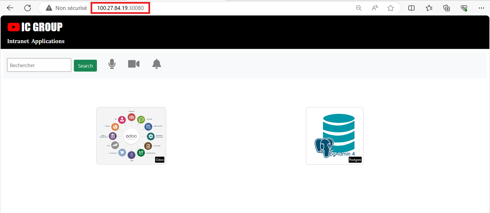
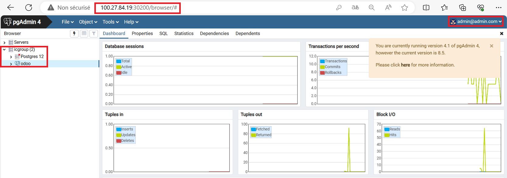
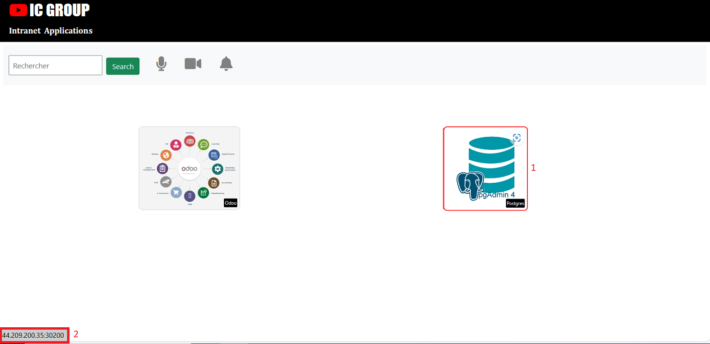
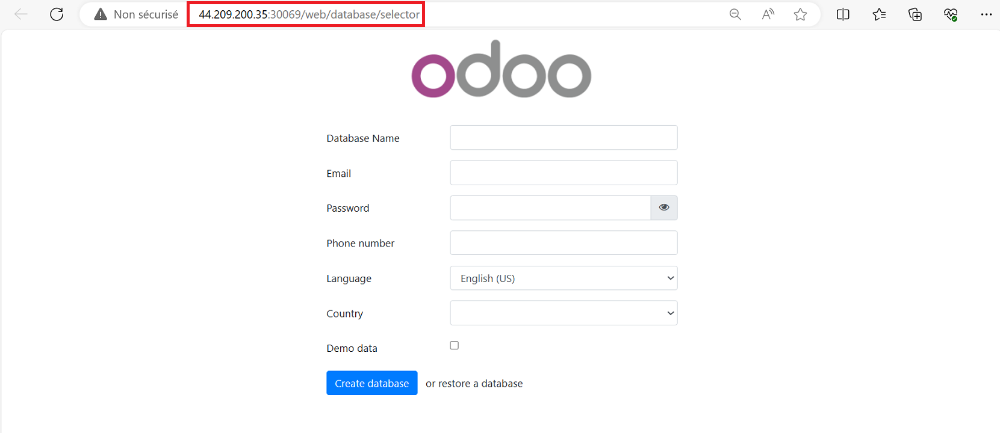

## PARTIE 3: Déploiement des différentes applications dans un cluster Kubernetes

## a. Architecture
L'entreprise souhaites à présent migrer ses applications sur cluster ``Kubernetes``, car semblerait -il que cette solution d'orchestration offre plus de possibilités que la solution native de docker, ``docker SWARM``. On se propose donc de donner une amélioration du Pipeline intégrant celà. Les applications pourront être déployées dans le cluster, selon l'architecture suivante:


Etant donné cette architecture logicielle, bien vouloir identifier en donnant le type et le rôle de chacune des ressources (A…H) mentionnées. 

L’ensemble de ces ressources devront être crées dans un namespace particulier appelé ``icgroup`` et devront obligatoirement avoir au moins le label ``env = prod``

## b. Identification des Ressources

### b.1 - Ressource A
La ressource en `A` est un Service de type `NodePort`, ce service va exposer à l'extérieur la ressource `B` `ic-webapp` à travers l'adresse IP de l'hôte et du port `30080` sous la forme `ip_instance:30080`.

>NB: les ports des services de type `NodePort` sont normalement attribués dynamiquement et compris entre `30000-32768`.

### b.2 - Ressource B 
La ressource `B` est un `Deployment` avec 2 Pods, il permet le déploiement de l'application `ic-webapp`.

### b.3 - Ressource C

La ressource `C` est un service de type `NodePort` qui va exposer la ressource `D` `odoo` sur le port `30069` sous la forme `ip_instance:30069`


### b.4 - Ressource D

La ressource `D` est un `Deployment` avec 2 pods , il permet le déploiement de l'application `odoo`

### b.5 - Ressource E 
La ressource `E` est un service de type `ClusterIP` qui va exposer la ressource `F` `Postgres` 
>***ClusterIP:*** *Expose le service sur une IP interne du cluster contrairement au NodePort qui expose via l'IP de l'hôte.*

### b.6 - Ressource F

La ressource `F` est une ressource de type `StatefulSet` avec un replicas de 01 `Pod` il permet le déploiement de la Base de données `Postgres`

>*à la différence du `Deployment` le `StatefulSet` est utilisé pour les applications à `état (stateful)` qui necéssite un stockage permenant des données.*

### b.7 - Ressource G

La ressource en `G` est un service de type `NodePort` qui va exposer la ressource `H` `(pgadmin)` sur le port `30200`

### b.8 - Ressource H

La ressource en `H` est un `Deployment` avec un replicas de 01 `Pod` , il permet le déploiement de l'application `Pgadmin`

>NB: Les ports à ouvrir dans la sécurity group `sg` seront modifiés pour être adapter aux des services de type `NodePort`:
- `8080` -> `30080` : `ic-webapp`
- `8081` -> `30200` : `pgadmin`
- `8069` -> `30069` : `odoo`

# c. Installation de Kubernetes
Pour des raisons de simplicité nous allons installer `k3s` pour avoir un cluster Mono Node. Cette installation se fera à l'aide d'un playbook ansible.

## c.1 - Organisation des répertoires et fichiers
### c.1.1 - Création des répertoires et fichiers
Procédons à l'organisation et à la création des différents répertoires et fichiers necéssaires à `ansible`.

Seuls les éléments necéssaires au déploiement de Kubernetes seront crées ici car les autres répertoires et fichiers ont étés abordés et crées précédemment dans la partie de déploiement de `Jenkins` voir [a.3 - Mise en place de notre serveur d'automatisation jenkins](#a-3-mise-en-place-de-notre-serveur-d-automatisation-jenkins)
```
touch src/ansible/group_vars/{prod_group.yml,staging_group.yml}
touch src/ansible/host_vars/{staging.yml,prod.yml}
touch src/playbooks/{deploy-apps-prod.yml,deploy-apps-staging.yml,prod-k3s.yml,staging-k3s.yml}
```

### c.1.2 - Rôles des répertoires et fichiers

- `group_vars/prod_group.yml` est le fichier qui va contenir les variables spécifiques aux hôtes de la prod
- `group_vars/staging_group.yml` est le fichier qui va contenir les variables spécifiques aux hôtes du groupe staging
- `host_vars/staging.yml`  va contenir les variables spécifiques à l'hôte de `staging`
- `host_vars/prod.yml` va contenir les variables spécifiques à l'hôte de la `prod`
- `hosts.yml` est le fichier dans lequel nous allons faire l' inventaire de nos hôtes, groupe d'hôtes et de la relation d'enfant entre groupe.
- `ansible.cfg` : c'est le cerveau et le cœur d'Ansible, le fichier qui régit le comportement de toutes les interactions effectuées par le nœud de contrôle
- `playbooks/deploy-apps-prod.yml`: playbook de déploiement des apps dans le group prod
- `playbooks/deploy-apps-staging.yml`: playbook de déploiement des apps dans le group staging
- `playbooks/prod-k3s.yml`: playbook de déploiement de kubernetes dans le group prod
- `playbooks/staging-k3s.yml`: playbook de déploiement de kubernetes dans le group staging
### c.1.3 - Édition des fichiers
- **group_vars/all.yml**
```
ansible_ssh_common_args: '-o StrictHostKeyChecking=no'
```
cet argument permet de désactiver la validation de la clé ssh au niveau de l'inventaire

- **host_vars/staging.yml** et **host_vars/prod.yml**
>Ces deux fichiers devront contenir `ansible_host` et `ansible_user` vu que ces informations ne seront connues qu'après le provisionning des serveurs nous allons donc modifier nos modules terraform en ajoutant une ressource `local_file`  pour générer automatiquement le Contenu de `host_vars/staging.yml` et `host_vars/prod.yml`(voir ci-dessous). 
Nous allons aussi ajouter `ansible_ssh_private_key_file` pour indiquer où se trouve la clée privée 

- **[Ressource local_file](#ressource-local-file)**
```
# Generate inventory file
resource "local_file" "staging_inventory" {
 filename = "staging.yml"
 content = <<EOF
---
ansible_host: ${module.ec2.ec2_eip}
ansible_user: ${var.aws_staging_username}
ansible_ssh_private_key_file: ../terraform/files/${var.aws_key_name}.pem
EOF
}
```
- **playbooks/deploy-apps-prod.yml**
```
---
- name: Deploying apps in prod
  hosts: prod
  become: true
  vars:
    ansible_python_interpreter: /usr/bin/python3
  roles:
    - roles/apps
```
- **playbooks/deploy-apps-staging.yml**
```
---
- name: Deploying apps in staging
  hosts: staging
  become: true
  vars:
    ansible_python_interpreter: /usr/bin/python3
  roles:
    - roles/apps
```
- **playbooks/prod-k3s.yml**
```
---
- name: Deploying Kubernetes on prod srv
  hosts: prod
  become: true
  vars:
    ansible_python_interpreter: /usr/bin/python3
  roles:
    - roles/k3s
```
- **playbooks/staging-k3s.yml**
```
---
- name: Deploying Kubernetes on staging srv
  hosts: staging
  become: true
  vars:
    ansible_python_interpreter: /usr/bin/python3
  roles:
    - roles/k3s
```
- **hosts.yml**
```
staging_group:
  children:
    staging_srv:
      hosts:
        staging:

prod_group:
  children:
    prod_srv:
      hosts:
        prod:
        
jenkins_group:
  children:
    cicd:
      hosts:
        jenkins:
```
- `staging_group` a pour enfant `(children)` `staging_srv` a qui appartient `l'hôte` `staging`.
- `prod_group` a pour enfant `(children)` `prod_srv` a qui appartient `l'hôte` `prod`.
- `jenkins_group` a pour enfant `(children)` `cicd` a qui appartient `l'hôte` `jenkins`.

####  - Vérification 

```
- ansible-inventory -i hosts.yml --graph
```
```
@all:
  |--@ungrouped:
  |--@staging_group:
  |  |--@staging_srv:
  |  |  |--staging
  |--@prod_group:
  |  |--@prod_srv:
  |  |  |--prod
  |--@jenkins_group:
  |  |--@cicd:
  |  |  |--jenkins
```

## c.2 - Création des roles
Pour simplifier le déploiement des applications nous allons procéder à la création de deux rôles:

- `k3s` pour **kubernetes**
- `apps` pour les applications *(le déploiement des applications se fera à l'aide d'un fichier kustomization.yml)*

### c.2.1 - Rôle K3s
```
ansible-galaxy init roles/k3s
- Role roles/k3s was created successfully
```
### c.2.2 - Rôle apps
```
ansible-galaxy init roles/apps
- Role roles/apps was created successfully
```
## c.3 - Mise en place des rôles
### c.3.1 - Rôle K3s

#### Edition des fichiers
Commençons par supprimer les répertoires dont nous n'avons pas bésoin ici. **(files, handlers, meta, templates, tests)**

```
rm -rf meta test templates handlers tests
```
---
**c.3.1.1 - le fichier `vars/main.yml`**

```
---
# vars file for roles/k3s
system_user: ubuntu
```
- `system_user`: l'utilisateur du système 

**c.3.1.2 - le fichier `tasks/main.yml`**

Ce fichier contient les tâches ci-dessous: 

**c.3.1.3 - Mise à jour des paquets du système**
```
- name: Update system packages
  become: true
  ansible.builtin.apt:
    name: "*"
    state: latest
    update_cache: true
    force_apt_get: yes
    
- name: Upgrade system packages
  become: true
  ansible.builtin.apt:
    upgrade: dist 
    force_apt_get: yes
```

**c.3.1.4 - Installation de Kubernetes**
```
- name: Create kube config Directory
  become: true
  ansible.builtin.file:
    path: /home/{{ system_user }}/.kube
    owner: "{{ system_user}}"
    group: "{{ system_user}}"
    mode: 'u=rwx,g=rwx,o=rx'
    dest: /home/{{ system_user }}/.kube
    state: directory 

- name: Download K3s
  ansible.builtin.get_url:
    url: https://get.k3s.io
    dest: /tmp/k3s-installer.sh

- name: Run K3s
  shell:
    cmd: cat /tmp/k3s-installer.sh | sh -s -- --write-kubeconfig-mode 644

- name: Copy config file
  ansible.builtin.copy:
    src: /etc/rancher/k3s/k3s.yaml
    dest: /home/{{ system_user }}/.kube
    remote_src: true

- name: Export KUBECONFIG
  shell:
    cmd: export KUBECONFIG=/home/{{ system_user }}/.kube
```
- **- name: Create kube config Directory**: Permet de créer le répertoire `~/.kube` qui va contenir les fichiers de configuration de k3s
- **- name: Download K3s**: Téléchargement des Binaires de kubernetes
- **- name: Run K3s**: Installation des Binaires kubernetes precédemment téléchargés
- **- name: Copy config file**: copie du fichier utilisé pour accéder au cluster kubernetes
- **- name: Export KUBECONFIG**: Permet de charger la configuration dans le répertoire `~/.kube`

**c.3.1.5 - Vérification**

```
- name: "Test kubernetes"
  command: kubectl get nodes
```
- Cette Tâche vérifie que le cluster fonctionne correctement

### c.3.2 - Rôle apps

#### Edition des fichiers
Supprimons les répertoires dont nous n'avons pas bésoin. **(files, handlers, meta, templates, tests)**

```
rm -rf meta test templates handlers tests
```

**c.3.2.1 - le fichier `vars/main.yml`**

- Contenu du fichier 
```
---
# vars file for roles/k3s
system_user: ubuntu
```
- `system_user`: l'utilisateur du système d'exploitation

**c.3.2.2 - le fichier `tasks/main.yml`**

Ce fichier contient les tâches ci-dessous :

**c.3.2.2.a - Copie des manifests kubernetes sur le serveur**
```
---
# tasks file for roles/apps
- name: Copy kubernetes manfest to remote host
  become: true
  ansible.builtin.copy:
    src: manifests/
    dest: /home/{{ system_user }}/manifests/
    owner: "{{ system_user }}"
    group: "{{ system_user }}"
    directory_mode: true
    mode: 'u=rwx,go=rwx'
```
Cette tâche à pour but de copier le dossier des manifests dans le home directory de l'utilisateur et lui affecter les droits sur ce repertoire

**c.3.2.2.b - Déploiement des applications**
```
- name: Déploiment des applications
  command: kubectl apply -k /home/{{ system_user }}/manifests/
```
Nous allons déployer nos manifests d'un seul coup à l'aide d'un fichier `kustomization.yml` et déclarer les manifests dans l'ordre de déploiement en commençant par le `namespace` *(vu que les applications doivent être dans le même namespace)* ensuite `postgres` et les autres.

## c.4 - Création des Manifests Kubernetes

**c.4.1 - namespace icgroup**
```
touch ic-namespace.yml
```
- Contenu
```
---
apiVersion: v1
kind: Namespace
metadata:
  name: icgroup
  labels:
    env: prod
status:
  phase: Active
```
**c.4.2 - PostgreSQL**

À l'instar de MySQL, Oracle et autres, PostgreSQL est une application à état **Stateful** qui nécessite de stocker et suivre des données de façon permanente,contrairement aux applications sans état **Stateless** comme Nginx.
Pour ce genre d'application il faut utiliser un `StatefulSet` et non un `Deployment`.

- Création des manifests de postgres 
```
mkdir -p postgres
touch postgres/{postgres-sts.yml, postgres-pv.yml, postgres-pvc.yml, postgres-secret.yml, postgres-svc.yml}
```
**c.4.2.a - postgres-secret.yml**

Ce fichier va contenir les paramètres de connexion de postgres
- Contenu du fichier secret
```
---
apiVersion: v1
kind: Secret
metadata:
  name: postgres-pass
  namespace: icgroup
  labels:
    env: prod
    app: postgresdb
type: Opaque
data:
  POSTGRES_DB: b2Rvbw==
  POSTGRES_USER: b2Rvbw==
  POSTGRES_PASSWORD: cGFzc3dvcmQ=
```
- **Remarque:**

il faut noter que mots de passe doivent être au format `Base64` qu'on peut générer avec la commande ci-dessous

```
echo -n "password"|base64
```

**c.4.2.b - postgres-svc.yml**

Cet objet va exposer postgres à l'applications `odoo` sur le port `5432`

- Contenu du fichier service
```
---
apiVersion: v1
kind: Service
metadata:
  name: postgres-svc
  namespace: icgroup
  labels:
    app: postgresdb
    env: prod
spec:
  ports:
    - protocol: TCP
      port: 5432
      targetPort: 5432
  selector:
    app: postgresdb
  type: ClusterIP
```
**c.4.2.c - postgres-pv.yml**

il va mettre à disposition un volume persistant (stockage) dans le cluster.

- Contenu du fichier PV (PersistentVolume)
```
apiVersion: v1
kind: PersistentVolume
metadata:
  name: postgres-pv
  labels:
    env: prod
    type: local
spec:
  storageClassName: manual
  capacity:
    storage: 5Gi 
  accessModes:
    - ReadWriteOnce
  hostPath:
    path: /data/postgresdb
```

**c.4.2.d - postgres-pvc.yml**

Il va permettre de faire une demande de 5Gi de stockage au `PersistentVolume`.

- Contenu du fichier PVC (PersistentVolumeClaim)
```
---
apiVersion: v1
kind: PersistentVolumeClaim
metadata:
  name: postgres-pvc
  namespace: icgroup
  labels:
    app: postgres
    env: prod
spec:
  accessModes:
    - ReadWriteOnce
  resources:
    requests:
      storage: 5Gi
```
**c.4.2.e - postgres-sts.yml**

Cet objet va permettre la mise en place de la Base de données postgreSQL 

- Contenu du fichier StatefulSet
```
---
apiVersion: apps/v1
kind: StatefulSet
metadata:
  name: postgresdb
  namespace: icgroup
  labels:
    app: postgresdb
    env: prod
spec:
  serviceName: postgresdb
  selector:
    matchLabels:
      app: postgresdb
  replicas: 1
  template:
    metadata:
      labels:
        app: postgresdb
    spec:
      containers:
      - image: postgres:12
        imagePullPolicy: IfNotPresent
        name: postgresdb
        env:
        - name: POSTGRES_USER
          value: odoo
        - name: POSTGRES_PASSWORD
          valueFrom:
            secretKeyRef:
              name: postgres-pass
              key: POSTGRES_PASSWORD

        - name: POSTGRES_DB
          value: odoo
        ports:
        - containerPort: 5432
          name: postgresdb
        volumeMounts:
        - name: postgres-persistent-storage
          mountPath: /var/lib/postgresql/data
      volumes:
      - name: postgres-persistent-storage
        persistentVolumeClaim:
          claimName: postgres-pvc
```
**c.4.3 - Pgadmin**
- Création des manifests de pgadmin 
```
mkdir -p pgadmin
touch pgadmin/{pgadmin-config.yml,pgadmin-pv.yml, pgadmin-pvc.yml, pgadmin-deploy.yml, pgadmin-svc.yml, pgadmin-secret.yml}
```
**c.4.3.a - pgadmin-config.yml**

Afin de fournir automatiquement à pgadmin les données nécessaires pour se connecter à la Base de donnée Odoo lorsqu'il rédemarre, nous allons créer et monter les fichiers `servers.json` et `pgpass` dans le repertoire `/pgadmin4`.

>NB: Ces deux fichiers seront montés dans un `configMap` et montés en `volumes` pour `postgreSQL`
```
touch pgadmin/{servers.json,pgpass}
```
- Contenu de servers.json
```
{
  "Servers": {
    "1": {
      "Name": "Postgres 12", 
      "Group": "icgroup",
      "Host": "postgres-svc", 
      "Port": "5432" ,
      "MaintenanceDB": "postgres", 
      "Username": "postgres",
      "SSLMode": "prefer",
      "PassFile": "/pgpass"
    }
  }
}
  
```
- Contenu de pgpass
```
postgres-svc:5432:postgres:postgres:password
```
- Contenu de pgadmin-config
```
apiVersion: v1
kind: ConfigMap
metadata:
  name: pgadmin-config
  namespace: icgroup
data:
  servers.json: |
    {
      "Servers": {
        "1": {
          "Name": "Postgres 12", 
          "Group": "icgroup",
          "Host": "postgres-svc", 
          "Port": "5432" ,
          "MaintenanceDB": "postgres", 
          "Username": "postgres",
          "SSLMode": "prefer",
          "PassFile": "/pgpass"
        }
      }
    }
  pgpass: |
    postgres-svc:5432:postgres:postgres:password
  
```
**c.4.3.b - pgadmin-pv.yml**

- Contenu du PV
```
apiVersion: v1
kind: PersistentVolume
metadata:
  name: pgadmin-pv
  labels:
    type: local
    env: prod
spec:
  storageClassName: manual
  capacity:
    storage: 5Gi
  accessModes:
    - ReadWriteOnce
  hostPath:
    path: /data/pgadmin
```
- Mise à disposition d'un stockage de 5Gi

**c.4.3.c - pgadmin-pvc.yml**

- Contenu du PVC
```
---
apiVersion: v1
kind: PersistentVolumeClaim
metadata:
  name: pgadmin-pvc
  namespace: icgroup
  labels:
    app: pgadmin
    env: prod
spec:
  accessModes:
    - ReadWriteOnce
  resources:
    requests:
      storage: 2Gi
```
- Demande de 2Gi sur les 5Gi

**c.4.3.d - pgadmin-secret.yml**

- Contenu du secret
```
apiVersion: v1
kind: Secret
metadata:
  name: pgadmin-secret
  namespace: icgroup
type: Opaque
data:
  pgadmin-default-password: bXlwd2Q=
```

**c.4.3.e - pgadmin-svc.yml**

- Contenu du service
```
apiVersion: v1
kind: Service
metadata:
  name: pgadmin
  namespace: icgroup
  labels:
    app: pgadmin
spec:
  selector:
   app: pgadmin
  type: NodePort
  ports:
   - port: 80
     nodePort: 30200
```
- Expose pgadmin sur le port statique `30200`

**c.4.3.f - pgadmin-deploy.yml**

- Contenu du deployment
```
apiVersion: apps/v1
kind: Deployment
metadata:
  name: pgadmin
  namespace: icgroup
spec:
  selector:
   matchLabels:
    app: pgadmin
  replicas: 1
  template:
    metadata:
      labels:
        app: pgadmin
    spec:
      containers:
        - name: pgadmin4
          image: dpage/pgadmin4:4.1
          env:
           - name: PGADMIN_DEFAULT_EMAIL
             value: "admin@admin.com"
           - name: PGADMIN_DEFAULT_PASSWORD
             valueFrom:
               secretKeyRef:
                 name: pgadmin-secret
                 key: pgadmin-default-password
           - name: PGADMIN_PORT
             value: "80"
          resources:
            limits:
              memory: "128Mi"
              cpu: "256m"
          ports:
            - containerPort: 80
              name: pgadminport
          volumeMounts:
          - name: pgadmin-config
            mountPath: /pgadmin4/servers.json
            subPath: servers.json
          - name: pgadmin-data
            mountPath: /var/lib/pgadmin
          - name: pgadmin-config
            mountPath: /var/lib/pgadmin/pgpass
            subPath: pgpass
      volumes:
      - name: pgadmin-config
        configMap:
          name: pgadmin-config
          items:
          - key: servers.json
            path: servers.json
          - key: pgpass
            path: pgpass
      - name: pgadmin-data
        persistentVolumeClaim:
          claimName: pgadmin-pvc
```
- Comme on peut le voir les fichier `servers.json` et `pgapass` sont programmés pour être montés dans le conteneur avec le `configMap`

**c.4.4 - Odoo**

- Création des manifests de **Odoo**
```
mkdir -p odoo
touch odoo/{odoo-secret.yml,odoo-pv.yml,odoo-pvc.yml,odoo-svc.yml,odoo-deployment.yml}
```
**c.4.4.a - odoo-secret.yml**

- Contenu de odoo-secret
```
---
apiVersion: v1
kind: Secret
metadata:
  name: odoo-pass
  namespace: icgroup
  labels:
    env: prod
type: Opaque
data:
  PASSWORD: cGFzc3dvcmQ=
```
**c.4.4.b - odoo-pv.yml**

- Contenu de odoo-pv
```
apiVersion: v1
kind: PersistentVolume
metadata:
  name: odoo-pv
  labels:
    env: prod
    type: local
spec:
  storageClassName: manual
  capacity:
    storage: 5Gi 
  accessModes:
    - ReadWriteOnce
  hostPath:
    path: /data/odoo
```
**c.4.4.c - odoo-pvc.yml**

- Contenu de odoo-pvc
```
---
apiVersion: v1
kind: PersistentVolumeClaim
metadata:
  name: odoo-pvc
  namespace: icgroup
  labels:
    app: odoo
    env: prod
spec:
  accessModes:
    - ReadWriteOnce
  resources:
    requests:
      storage: 2Gi
```
**c.4.4.d - odoo-svc.yml**

- Contenu de odoo-svc
```
apiVersion: v1
kind: Service
metadata:
  name: odoo-svc
  labels:
    app: odoo
    env: prod
  namespace: icgroup
spec:
  ports:
    - protocol: TCP
      port: 8069
      targetPort: 8069
      nodePort: 30069
  selector:
    app: odoo
  type: NodePort
```
**c.4.4.e - odoo-deployment.yml**

- Contenu de odoo-deployment
```
apiVersion: apps/v1
kind: Deployment
metadata:
  name: odoo
  namespace: icgroup
  labels:
    app: odoo
    env: prod
spec:
  selector:
    matchLabels:
      app: odoo
  replicas: 2
  template:
    metadata:
      labels:
        app: odoo 
    spec:
      containers:
      - name: odoo 
        image: odoo:13
        resources:
          limits:
            memory: "64Mi"
            cpu: "128m"
        env:
        - name: HOST
          value: postgres-svc
        - name: USER
          value: odoo
        - name: PASSWORD
          valueFrom:
            secretKeyRef:
              name: postgres-pass
              key: POSTGRES_PASSWORD
        ports:
        - containerPort: 8069
        volumeMounts:
        - name: odoo-etc-storage
          mountPath: /etc/odoo/
        - name: odoo-addons-storage
          mountPath: /mnt/extra-addons
        - name: odoo-lib-storage
          mountPath: /var/lib/odoo
      volumes:
      - name: odoo-etc-storage
        hostPath:
          path: /data/odoo/config
      - name: odoo-addons-storage
        hostPath:
          path: /data/odoo/addons
      - name: odoo-lib-storage
        persistentVolumeClaim:
          claimName: odoo-pvc
```
**c.5 - ic-webapp**

- Création des manifests de **ic-webapp**
```
mkdir -p ic-webapp
touch ic-webapp/{ic-webapp-svc.yml, ic-webapp-deployment.yml}
```
**c.5.a - ic-webapp-svc.yml**

- Contenu de ic-webapp-svc
```
apiVersion: v1
kind: Service
metadata:
  name: ic-webapp-svc
  labels:
    app: ic-webapp
    env: prod
  namespace: icgroup
spec:
  ports:
    - protocol: TCP
      port: 8080
      targetPort: 8080
      nodePort: 30080
  selector:
    app: ic-webapp
  type: NodePort
```

**c.5.b - ic-webapp-deployment.yml**

- Contenu de ic-webapp-deployment
```
apiVersion: apps/v1
kind: Deployment
metadata:
  name: ic-webapp
  namespace: icgroup
  labels:
    app: ic-webapp
    env: prod
spec:
  selector:
    matchLabels:
      app: ic-webapp
  replicas: 2
  template:
    metadata:
      labels:
        app: ic-webapp 
    spec:
      containers:
      - name: ic-webapp
        image: openlab89/ic-webapp:1.0
        resources:
          limits:
            memory: "128Mi"
            cpu: "256m"
        env:
        - name: ODOO_URL
          value: "http://$INSTANCE:30069"
        - name: PGADMIN_URL
          value: "http://$INSTANCE:30200"
        ports:
        - containerPort: 8080
```

- `image: openlab89/ic-webapp:1.0`: l'image docker buildée et pushée sur dockerhub
- `value: "http://$INSTANCE:30069"`: vu que `$INSTANCE` doit être fourni dynamiquement nous allons ajouter une ressource `local_file` dans nos modules `terraform` pour générer le manifest `ic-webapp-deployment.yml` en remplaçant `$INSTANCE` par l'adresse publique de l'hôte fournie par le module `eip` lors du provisionning.

- **[ressource local file](#ressource-local-file)**
```
resource "local_file" "deployment_template" {
  content = templatefile("deployment_template.yml", {
    INSTANCE = "${module.ec2.ec2_eip}"
    }
  )
  filename = "ic-webapp-deployment.yml"
}
```
- `content = templatefile("deployment_template.yml"`: une copie du manifest de déploiement de `ic-webapp` à générer 
- `INSTANCE = "${module.ec2.ec2_eip}"`: remplace `$INSTANCE` par l'adresse ip publique de l'hôte
- `filename = "ic-webapp-deployment.yml"`: nouveau manifest de `ic-webapp` généré avec l'adresse ip publique de l'hôte.

**c.6 - Création du fichier kustomization**
```
touch kustomization.yml
```
- Contenu
```
resources:
  # namespace
  - ic-namespace.yml
  # postgres
  - postgres/postgres-pv.yml
  - postgres/postgres-pvc.yml
  - postgres/postgres-secret.yml
  - postgres/postgres-sts.yml
  - postgres/postgres-svc.yml
  # pgadmin
  - pgadmin/pgadmin-config.yml
  - pgadmin/pgadmin-pv.yml
  - pgadmin/pgadmin-pvc.yml
  - pgadmin/pgadmin-secret.yml
  - pgadmin/pgadmin-deploy.yml
  - pgadmin/pgadmin-svc.yml
  # odoo
  - odoo/odoo-pv.yml
  - odoo/odoo-pvc.yml
  - odoo/odoo-secret.yml
  - odoo/odoo-svc.yml
  - odoo/odoo-deployment.yml
  # ic-webapp
  - ic-webapp/ic-webapp-deployment.yml
  - ic-webapp/ic-webapp-svc.yml
```
Le déploiement se fera par ordre en commençant par le `namespace`

# d. Mise en place du pipeline CI/CD 

Nous allons apporter une modification à notre précédent `PIPELINE` pour l'adapter à Ansible

## d.1 - Les Stages

```
stages:
  - 1. Cloning code
  - 2. Build image
  - 3. Test acceptation
  - 4. Release image
  - 5. Create staging EC2
  - 6. Install k8s on staging 
  - 7. Deploy apps on staging
  - 8. Create prod EC2
  - 9. Install K8s on prod
  - 10. Deploy apps on prod 
```
Nous avons apportés des modifications aux précédents stages en changeant les noms de certains stages et supprimer les stages de tests

### Description des stages
- `Cloning code` : Récupère le code depuis github
- `Build image` : Construction de l'image docker
- `Test acceptation`: Teste de l'image
- `Release image`: Publication de l'image sur docker hub
- `Create staging EC2`: Création de l'instance `EC2` de Staging
- `Install k8s on staging `: Installation de Kubernetes sur le serveur de Staging
- `Deploy apps on staging`: Déploiement des applications sur le serveur de Staging
- `Create prod EC2`: Création de l'instance `EC2` de Prod
- `Install K8s on prod`: Installation de Kubernetes sur le serveur de Prod
- `Deploy apps on prod`: Déploiement des applications sur le serveur de prod

## d.2 - Edition du Jenkinsfile

Toujours dans l'optique d'eviter les répétitions de code faisant les mêmes tâches, nous allons écrire 03 fonctions en `groovy` et les appelées quand il faut.

Elle seront associées à notre dépot github [shared-library](https://github.com/gbaneassouman/shared-library), ces fonctions sont:
- une fonction pour la création d'instance (en Staging et à la prod)
- Une autre pour l'installation de kubernetes
- Une dernière pour le déploiement des applications

**1 - Création des fonctions**
```
shared-library$ touch vars/ansible.groovy 
```
**2 - Écriture des fonctions**

- **1 - fonction de création d'instance EC2**
```
#!/usr/bin/env groovy
//
/* groovylint-disable MethodParameterTypeRequired, MethodReturnTypeRequired, NoDef, UnusedMethodParameter */ 

def init(name) {
    /* groovylint-disable-next-line GStringExpressionWithinString */
    sh "terraform -chdir=src/terraform/${name} init -input=false"
}

def plan(name) {
    /* groovylint-disable-next-line GStringExpressionWithinString */
    sh "terraform -chdir=src/terraform/${name} plan -out ${name}.plan"
}

/* groovylint-disable-next-line GStringExpressionWithinString, MethodParameterTypeRequired */
def apply(name) {
    /* groovylint-disable-next-line GStringExpressionWithinString */
    sh "terraform -chdir=src/terraform/${name} apply ${name}.plan"
}
```
**Description**

Nous avons ici 03 fonctions, une pour initialiser terraform `init`, une pour afficher les futurs changéments `plan` et la dernière pour appliquer `apply`.
Elles réçoivent toutes l'argument `name` ***(staging ou prod)*** pour selectionner le l'environment de provisionning.

- **2 - fonction d'installation de kubernetes**
```
#!/usr/bin/env groovy
/* groovylint-disable GStringExpressionWithinString, LineLength, MethodReturnTypeRequired, NoDef, UnusedMethodParameter */
def install_kubernetes(String dirname) {
    /* groovylint-disable-next-line LineLength */
    if ( dirname == 'staging' ) {
        sh '''
            #!/bin/bash
            cp $TF_DIR/staging/staging.yml src/ansible/host_vars/staging.yml
            cp $TF_DIR/staging/ic-webapp-deployment.yml src/ansible/playbooks/manifests/ic-webapp/ic-webapp-deployment.yml
            cd $PWD/src/ansible
            ansible-playbook -i hosts.yml playbooks/staging-k3s.yml
        '''
    }
    else if ( dirname == 'prod' ) {
        sh '''
            #!/bin/bash
            cp $TF_DIR/prod/ic-webapp-deployment.yml src/ansible/playbooks/manifests/ic-webapp/ic-webapp-deployment.yml
            cp $TF_DIR/prod/prod.yml src/ansible/host_vars/prod.yml
            cd $PWD/src/ansible
            ansible-playbook -i hosts.yml playbooks/prod-k3s.yml
        '''
    }
}
```
**Description**

Cette fonction réçoit en argument staging où prod pour copier les fichiers générés par les resources `local_file` de terraform  et lancer le `playbook` en selectionnant le nom du dossier réçu en paramètre.

- **3 - fonction de déploiement des applications**
```
/* groovylint-disable-next-line NoDef */
def deploy_apps(String dirname) {
    /* groovylint-disable-next-line DuplicateStringLiteral, EmptyIfStatement, LineLength */
    if ( dirname == 'staging') {
        sh '''
            #!/bin/bash
            cp $TF_DIR/staging/staging.yml src/ansible/host_vars/staging.yml
            cp $TF_DIR/staging/ic-webapp-deployment.yml src/ansible/playbooks/manifests/ic-webapp/ic-webapp-deployment.yml
            cd $PWD/src/ansible
            ansible-playbook -i hosts.yml playbooks/deploy-apps-staging.yml
        '''
    }
    /* groovylint-disable-next-line DuplicateStringLiteral */
    else if ( dirname == 'prod') {
        sh '''
            #!/bin/bash
            cp $TF_DIR/prod/ic-webapp-deployment.yml src/ansible/playbooks/manifests/ic-webapp/ic-webapp-deployment.yml
            cp $TF_DIR/prod/prod.yml src/ansible/host_vars/prod.yml
            cd $PWD/src/ansible
            ansible-playbook -i hosts.yml playbooks/deploy-apps-prod.yml
        '''
    }
}
```

**Description**

Cette fonction exécute le `playbook` `deploy-apps-prod.yml` ou `deploy-apps-staging.yml` en fonction du nom réçu en paramètre.

**- Contenu du Jenkinsfile**
```
/* groovylint-disable CompileStatic, NglParseError, UnnecessaryObjectReferences */
/* groovylint-disable DuplicateListLiteral, DuplicateStringLiteral, GStringExpressionWithinString, LineLength, NestedBlockDepth, NglParseError */
/* groovylint-disable-next-line CompileStatic */
/* groovylint-disable-next-line CompileStatic, NglParseError */
/* import shared library */
/* groovylint-disable-next-line CompileStatic */
/* groovylint-disable-next-line CompileStatic */

@Library('slack-shared-library') _

pipeline {
    environment {
        DOCKERHUB_PASSWORD  = credentials('DOCKER_HUB_ID')
        IMAGE_TAG = '1.0'
        IMAGE_NAME = 'ic-webapp'
        HOST_PORT = '8000'
        CONTAINER_PORT = '8080'
        TEST_CONTAINER = 'test-ic-webapp'
        DOCKER_HUB = 'openlab89'
        TF_DIR = '/var/lib/jenkins/workspace/projet-fil-rouge/src/terraform'
        ANS_DIR = '$WORKSPACE/src/ansible'
        IP_FILE = 'src/terraform/$ENV_NAME/files/infos_ec2.txt'
        AWS_ACCESS_KEY_ID = credentials('AWS_ACCESS_KEY_ID')
        AWS_SECRET_ACCESS_KEY = credentials('AWS_SECRET_ACCESS_KEY')
        AWS_PRIVATE_KEY = credentials('AWS_SSH_KEY')
        AWS_KEY_NAME = 'devops-gbane'
    }
    agent any //declaration globale de l'agent
    stages {
        stage('Cloning code') {
            steps {
                script {
                    sh '''
                         rm -rf projet-fil-rouge-with-jenkins || echo "Directory doesn't exists "
                         sleep 2
                         git clone https://github.com/gbaneassouman/projet-fil-rouge-with-jenkins.git
                     '''
                }
            }
        }
        stage('Build image') {
            steps {
                script {
                     /* groovylint-disable-next-line GStringExpressionWithinString */
                    sh '''
                       docker build --no-cache -f ./src/Dockerfile -t ${IMAGE_NAME}:${IMAGE_TAG} ./src/
                    '''
                }
            }
        }
        stage('Test image') {
            steps {
                script {
                    /* groovylint-disable-next-line GStringExpressionWithinString */
                    sh 'docker stop ${TEST_CONTAINER} || true && docker rm ${TEST_CONTAINER} || true'
                    sh 'docker run --name ${TEST_CONTAINER} -d -p ${HOST_PORT}:${CONTAINER_PORT} -e PORT=${CONTAINER_PORT} ${IMAGE_NAME}:${IMAGE_TAG}'
                    sh 'sleep 10'
                    sh 'curl -k http://172.17.0.1:${HOST_PORT}| grep -i "Odoo"'
                }
            }
        }
        stage('Release image') {
            steps {
                script {
                    /* groovylint-disable-next-line GStringExpressionWithinString */
                    sh '''
                        docker stop ${TEST_CONTAINER} || true && docker rm ${TEST_CONTAINER} || true
                        docker save ${IMAGE_NAME}:${IMAGE_TAG} > /tmp/${IMAGE_NAME}:${IMAGE_TAG}.tar
                        docker image tag ${IMAGE_NAME}:${IMAGE_TAG} ${DOCKER_HUB}/${IMAGE_NAME}:${IMAGE_TAG}
                        echo $DOCKERHUB_PASSWORD_PSW | docker login -u ${DOCKER_HUB} --password-stdin
                        docker push ${DOCKER_HUB}/${IMAGE_NAME}:${IMAGE_TAG}
                    '''
                }
            }
        }
        stage('Create staging EC2') {
            steps {
                script {
                    /* groovylint-disable-next-line GStringExpressionWithinString ** */
                    aws('staging')
                    terraform.init('staging')
                    terraform.plan('staging')
                    terraform.apply('staging')
                }
            }
        }
        stage('Install k8s on staging') {
            steps {
                script {
                    /* groovylint-disable-next-line GStringExpressionWithinString * */
                    aws('staging')
                    ansible.install_kubernetes('staging')
                }
            }
        }
        stage('Deploy apps on staging') {
            steps {
                script {
                    ansible.deploy_apps('staging')
                }
            }
        }
        stage('Create prod EC2') {
            steps {
                script {
                    /* groovylint-disable-next-line GStringExpressionWithinString */
                    aws('prod')
                    terraform.init('prod')
                    terraform.plan('prod')
                    terraform.apply('prod')
                }
            }
        }
        stage('Install K8s on prod') {
            steps {
                script {
                    /* groovylint-disable-next-line GStringExpressionWithinString */
                    aws('prod')
                    ansible.install_kubernetes('prod')
                }
            }
        }
        stage('Deploy apps on prod ') {
            steps {
                script {
                    ansible.deploy_apps('prod')
                }
            }
        }
    }
    post {
        always {
            script {
                /* Use Slack-notification.groovy from shared library */
                slackNotifier currentBuild.result
            }
        }
    }
}
```
- **Exécution du Pipeline**

Pour faire déclencher notre pipeline nous allons apporter une modification à notre code en modifiant les ports à ouvrir au niveau de terraform.

```
git add .
git commit -m "Adapt ec2 ports to be opened for k8s environment"
git push origin main
```

## Résultats
**Pipeline**


**Notification Slack**


- **Démarrage**
```
Started by GitHub push by gbaneassouman
Obtained Jenkinsfile from git https://github.com/gbaneassouman/projet-fil-rouge-with-jenkins.git
Loading library slack-shared-library@main
Attempting to resolve main from remote references...
 > git --version # timeout=10
 > git --version # 'git version 2.17.1'
 > git ls-remote -h -- https://github.com/gbaneassouman/shared-library.git # timeout=10
```
- **clonage du code**
```
+ rm -rf projet-fil-rouge-with-jenkins
+ sleep 2
+ git clone https://github.com/gbaneassouman/projet-fil-rouge-with-jenkins.git
Cloning into 'projet-fil-rouge-with-jenkins'...
```
- **build du code**

```
+ docker build --no-cache -f ./src/Dockerfile -t ic-webapp:1.0 ./src/
#1 [internal] load .dockerignore
#1 transferring context: 2B done
#1 DONE 0.0s
```
- **arrêt du conteneur**
```
+ docker stop test-ic-webapp
Error response from daemon: No such container: test-ic-webapp
+ true
+ docker rm test-ic-webapp
Error response from daemon: No such container: test-ic-webapp
+ true
[Pipeline] sh
+ docker run --name test-ic-webapp -d -p 8000:8080 -e PORT=8080 ic-webapp:1.0
33f36bc2cace53d681f41827348d5a285ca2a5abdd4676a8c90c34da6cba2578
[Pipeline] sh
+ sleep 10
[Pipeline] sh
+ grep -i Odoo
+ curl -k http://172.17.0.1:8000
  % Total    % Received % Xferd  Average Speed   Time    Time     Time  Current
                                 Dload  Upload   Total   Spent    Left  Speed

  0     0    0     0    0     0      0      0 --:--:-- --:--:-- --:--:--     0
100  3832  100  3832    0     0   220k      0 --:--:-- --:--:-- --:--:--  220k
                   <a href="https://www.odoo.com/"><div id="img_container">
                        
                        <span class="opt3">Odoo</span>
```

- **envoie de l'image sur dockerhub**
```
+ docker image tag ic-webapp:1.0 openlab89/ic-webapp:1.0
+ + echo ****
docker login -u openlab89 --password-stdin
WARNING! Your password will be stored unencrypted in /var/lib/jenkins/.docker/config.json.
Configure a credential helper to remove this warning. See
https://docs.docker.com/engine/reference/commandline/login/#credentials-store

Login Succeeded
+ docker push openlab89/ic-webapp:1.0
The push refers to repository [docker.io/openlab89/ic-webapp]
```
- **Création de l'instance**
```
[Pipeline] { (Create staging EC2)
[Pipeline] script
[Pipeline] {
[Pipeline] sh
+ rm -rf devops-gbane.pem /var/lib/jenkins/.aws
+ mkdir -p /var/lib/jenkins/.aws
+ echo [default]
+ echo aws_access_key_id=****
+ echo aws_secret_access_key=****
+ echo aws_profile=
+ rm -rf /var/lib/jenkins/workspace/projet-fil-rouge/src/terraform/staging/files/devops-gbane.pem
+ cat ****
+ chmod 400 /var/lib/jenkins/workspace/projet-fil-rouge/src/terraform/staging/files/devops-gbane.pem
+ chmod 400 /var/lib/jenkins/.aws/credentials
[Pipeline] sh
+ terraform -chdir=src/terraform/staging init -input=false
```
- **terraform plan**
```
+ terraform -chdir=src/terraform/staging plan -out staging.plan
module.ec2.data.aws_ami.app_ami: Reading...
module.ec2.aws_security_group.allow_http_https_ssh: Refreshing state... [id=sg-077d37711530c57f9]
module.ec2.data.aws_ami.app_ami: Read complete after 0s [id=ami-055744c75048d8296]
module.ec2.aws_instance.projet_fil_rouge: Refreshing state... [id=i-08d607c4860601227]
module.ec2.aws_eip.lb: Refreshing state... [id=eipalloc-06a9f0be668268803]
local_file.deployment_template: Refreshing state... [id=1f35cae22159952dd2afb5bfac5086c72bdaf3e2]
local_file.staging_inventory: Refreshing state... [id=66433d8901d0f69258ff343c79a9ed5d0c1ac8dd]
```

- **terraform apply**
```
+ terraform -chdir=src/terraform/staging apply staging.plan
module.ec2.aws_instance.projet_fil_rouge: Creating...
module.ec2.aws_security_group.allow_http_https_ssh: Modifying... [id=sg-077d37711530c57f9]
module.ec2.aws_security_group.allow_http_https_ssh: Modifications complete after 1s [id=sg-077d37711530c57f9]
module.ec2.aws_instance.projet_fil_rouge: Still creating... [10s elapsed]
module.ec2.aws_instance.projet_fil_rouge: Still creating... [20s elapsed]
module.ec2.aws_instance.projet_fil_rouge: Still creating... [30s elapsed]
module.ec2.aws_instance.projet_fil_rouge: Still creating... [40s elapsed]
```

- **Remote exec on staging ec2**
```
module.ec2.aws_instance.projet_fil_rouge (remote-exec): Connecting to remote host via SSH...
module.ec2.aws_instance.projet_fil_rouge (remote-exec):   Host: 54.144.224.32
module.ec2.aws_instance.projet_fil_rouge (remote-exec):   User: ubuntu
module.ec2.aws_instance.projet_fil_rouge (remote-exec):   Password: false
module.ec2.aws_instance.projet_fil_rouge (remote-exec):   Private key: true
module.ec2.aws_instance.projet_fil_rouge (remote-exec):   Certificate: false
module.ec2.aws_instance.projet_fil_rouge (remote-exec):   SSH Agent: false
module.ec2.aws_instance.projet_fil_rouge (remote-exec):   Checking Host Key: false
module.ec2.aws_instance.projet_fil_rouge (remote-exec):   Target Platform: unix
module.ec2.aws_instance.projet_fil_rouge (remote-exec): Connected!
```

- **Exécution du script**
```
module.ec2.aws_instance.projet_fil_rouge (remote-exec): 78
module.ec2.aws_instance.projet_fil_rouge (remote-exec): # Executing docker install script, commit: e5543d473431b782227f8908005543bb4389b8de
module.ec2.aws_instance.projet_fil_rouge (remote-exec): + sh -c apt-get update -qq >/dev/null
module.ec2.aws_instance.projet_fil_rouge: Still creating... [1m10s elapsed]
module.ec2.aws_instance.projet_fil_rouge (remote-exec): + sh -c DEBIAN_FRONTEND=noninteractive apt-get install -y -qq apt-transport-https ca-certificates curl >/dev/null
module.ec2.aws_instance.projet_fil_rouge (remote-exec): + sh -c install -m 0755 -d /etc/apt/keyrings
module.ec2.aws_instance.projet_fil_rouge (remote-exec): + sh -c curl -fsSL "https://download.docker.com/linux/ubuntu/gpg" | gpg --dearmor --yes -o /etc/apt/keyrings/docker.gpg
```
- **Installation du kubernetes**

```
[Pipeline] { (Install k8s on staging)
[Pipeline] script
[Pipeline] {
[Pipeline] sh
+ rm -rf devops-gbane.pem /var/lib/jenkins/.aws
+ mkdir -p /var/lib/jenkins/.aws
+ echo [default]
+ echo aws_access_key_id=****
+ echo aws_secret_access_key=****
+ echo aws_profile=
+ rm -rf /var/lib/jenkins/workspace/projet-fil-rouge/src/terraform/staging/files/devops-gbane.pem
+ cat ****
+ chmod 400 /var/lib/jenkins/workspace/projet-fil-rouge/src/terraform/staging/files/devops-gbane.pem
+ chmod 400 /var/lib/jenkins/.aws/credentials
[Pipeline] sh
+ cp /var/lib/jenkins/workspace/projet-fil-rouge/src/terraform/staging/staging.yml src/ansible/host_vars/staging.yml
+ cp /var/lib/jenkins/workspace/projet-fil-rouge/src/terraform/staging/ic-webapp-deployment.yml src/ansible/playbooks/manifests/ic-webapp/ic-webapp-deployment.yml
+ cd /var/lib/jenkins/workspace/projet-fil-rouge/src/ansible
+ ansible-playbook -i hosts.yml playbooks/staging-k3s.yml
/usr/lib/python2.7/getpass.py:83: GetPassWarning: Can not control echo on the terminal.
  passwd = fallback_getpass(prompt, stream)
Warning: Password input may be echoed.
BECOME password: 
PLAY [Deploying Kubernetes on staging srv] *************************************

TASK [Gathering Facts] *********************************************************
ok: [staging]

TASK [k3s : Update system packages] ********************************************
changed: [staging]

TASK [k3s : Upgrade system packages] *******************************************
ok: [staging]

TASK [k3s : Create kube config Directory] **************************************
[WARNING]: Both option path and its alias dest are set.
changed: [staging]

TASK [k3s : Download K3s] ******************************************************
changed: [staging]

TASK [k3s : Run K3s] ***********************************************************
changed: [staging]

TASK [k3s : Copy config file] **************************************************
changed: [staging]

TASK [k3s : Export KUBECONFIG] *************************************************
changed: [staging]

TASK [k3s : Test kubernetes] ***************************************************
changed: [staging]

PLAY RECAP *********************************************************************
staging                    : ok=9    changed=7    unreachable=0    failed=0    skipped=0    rescued=0    ignored=0   
```
- **Déploiement des applications**
```
[Pipeline] { (Deploy apps on staging)
[Pipeline] script
[Pipeline] {
[Pipeline] sh
+ cp /var/lib/jenkins/workspace/projet-fil-rouge/src/terraform/staging/staging.yml src/ansible/host_vars/staging.yml
+ cp /var/lib/jenkins/workspace/projet-fil-rouge/src/terraform/staging/ic-webapp-deployment.yml src/ansible/playbooks/manifests/ic-webapp/ic-webapp-deployment.yml
+ cd /var/lib/jenkins/workspace/projet-fil-rouge/src/ansible
+ ansible-playbook -i hosts.yml playbooks/deploy-apps-staging.yml
/usr/lib/python2.7/getpass.py:83: GetPassWarning: Can not control echo on the terminal.
  passwd = fallback_getpass(prompt, stream)
Warning: Password input may be echoed.
BECOME password: 
PLAY [Deploying apps in staging] ***********************************************

TASK [Gathering Facts] *********************************************************
ok: [staging]

TASK [apps : Copy kubernetes manfest to remote host] ***************************
changed: [staging]

TASK [apps : Déploiment des applications] **************************************
changed: [staging]

PLAY RECAP *********************************************************************
staging                    : ok=3    changed=2    unreachable=0    failed=0    skipped=0    rescued=0    ignored=0   
```

**ic-webapp**

--
**Url de odoo**

---
**Url de pgadmin**

---
**Odoo**

---
**pgadmin**

---

---

---

---

- **Création de l'instance de prod**
```
[Pipeline] { (Create prod EC2)
[Pipeline] script
[Pipeline] {
[Pipeline] sh
+ rm -rf devops-gbane.pem /var/lib/jenkins/.aws
+ mkdir -p /var/lib/jenkins/.aws
+ echo [default]
+ echo aws_access_key_id=****
+ echo aws_secret_access_key=****
+ echo aws_profile=
+ rm -rf /var/lib/jenkins/workspace/projet-fil-rouge/src/terraform/prod/files/devops-gbane.pem
+ cat ****
+ chmod 400 /var/lib/jenkins/workspace/projet-fil-rouge/src/terraform/prod/files/devops-gbane.pem
+ chmod 400 /var/lib/jenkins/.aws/credentials
[Pipeline] sh
+ terraform -chdir=src/terraform/prod init -input=false

Initializing the backend...
Initializing modules...

Initializing provider plugins...
- Reusing previous version of hashicorp/local from the dependency lock file
- Reusing previous version of hashicorp/aws from the dependency lock file
- Using previously-installed hashicorp/local v2.5.1
- Using previously-installed hashicorp/aws v5.46.0
```

- **terraform plan**
```
+ terraform -chdir=src/terraform/prod plan -out prod.plan
module.ec2.data.aws_ami.app_ami: Reading...
module.ec2.aws_security_group.allow_http_https_ssh: Refreshing state... [id=sg-0cb7d7682ec1a2616]
module.ec2.data.aws_ami.app_ami: Read complete after 0s [id=ami-055744c75048d8296]
module.ec2.aws_instance.projet_fil_rouge: Refreshing state... [id=i-0c4297daeae15d8cb]
module.ec2.aws_eip.lb: Refreshing state... [id=eipalloc-074bdf34978d0361a]
local_file.deployment_template: Refreshing state... [id=1bb4d41df90ab5b94232dd321976f08b5c167c60]
local_file.staging_inventory: Refreshing state... [id=13e08b839eb4c8e4b5588eecb977238811563087]
```
- **terraform apply**
```
+ terraform -chdir=src/terraform/prod apply prod.plan
module.ec2.aws_security_group.allow_http_https_ssh: Modifying... [id=sg-0cb7d7682ec1a2616]
module.ec2.aws_instance.projet_fil_rouge: Creating...
module.ec2.aws_security_group.allow_http_https_ssh: Modifications complete after 1s [id=sg-0cb7d7682ec1a2616]
module.ec2.aws_instance.projet_fil_rouge: Still creating... [10s elapsed]
module.ec2.aws_instance.projet_fil_rouge: Still creating... [20s elapsed]
module.ec2.aws_instance.projet_fil_rouge: Still creating... [30s elapsed]
module.ec2.aws_instance.projet_fil_rouge: Still creating... [40s elapsed]
module.ec2.aws_instance.projet_fil_rouge: Still creating... [50s elapsed]
```

- **Remote exec on prod ec2**
```
module.ec2.aws_instance.projet_fil_rouge: Provisioning with 'remote-exec'...
module.ec2.aws_instance.projet_fil_rouge (remote-exec): Connecting to remote host via SSH...
module.ec2.aws_instance.projet_fil_rouge (remote-exec):   Host: 54.87.252.46
module.ec2.aws_instance.projet_fil_rouge (remote-exec):   User: ubuntu
module.ec2.aws_instance.projet_fil_rouge (remote-exec):   Password: false
module.ec2.aws_instance.projet_fil_rouge (remote-exec):   Private key: true
module.ec2.aws_instance.projet_fil_rouge (remote-exec):   Certificate: false
module.ec2.aws_instance.projet_fil_rouge (remote-exec):   SSH Agent: false
module.ec2.aws_instance.projet_fil_rouge (remote-exec):   Checking Host Key: false
```

- **Exécution du script**
```
module.ec2.aws_instance.projet_fil_rouge (remote-exec): 78
module.ec2.aws_instance.projet_fil_rouge (remote-exec): # Executing docker install script, commit: e5543d473431b782227f8908005543bb4389b8de
module.ec2.aws_instance.projet_fil_rouge (remote-exec): + sh -c apt-get update -qq >/dev/null
module.ec2.aws_instance.projet_fil_rouge: Still creating... [1m10s elapsed]
module.ec2.aws_instance.projet_fil_rouge (remote-exec): + sh -c DEBIAN_FRONTEND=noninteractive apt-get install -y -qq apt-transport-https ca-certificates curl >/dev/null
module.ec2.aws_instance.projet_fil_rouge (remote-exec): + sh -c install -m 0755 -d /etc/apt/keyrings
module.ec2.aws_instance.projet_fil_rouge (remote-exec): + sh -c curl -fsSL "https://download.docker.com/linux/ubuntu/gpg" | gpg --dearmor --yes -o /etc/apt/keyrings/docker.gpg
```

- **Installation de kubernetes sur la prod**

```
[Pipeline] { (Install K8s on prod)
[Pipeline] script
[Pipeline] {
[Pipeline] sh
+ rm -rf devops-gbane.pem /var/lib/jenkins/.aws
+ mkdir -p /var/lib/jenkins/.aws
+ echo [default]
+ echo aws_access_key_id=****
+ echo aws_secret_access_key=****
+ echo aws_profile=
+ rm -rf /var/lib/jenkins/workspace/projet-fil-rouge/src/terraform/prod/files/devops-gbane.pem
+ cat ****
+ chmod 400 /var/lib/jenkins/workspace/projet-fil-rouge/src/terraform/prod/files/devops-gbane.pem
+ chmod 400 /var/lib/jenkins/.aws/credentials
[Pipeline] sh
+ cp /var/lib/jenkins/workspace/projet-fil-rouge/src/terraform/prod/ic-webapp-deployment.yml src/ansible/playbooks/manifests/ic-webapp/ic-webapp-deployment.yml
+ cp /var/lib/jenkins/workspace/projet-fil-rouge/src/terraform/prod/prod.yml src/ansible/host_vars/prod.yml
+ cd /var/lib/jenkins/workspace/projet-fil-rouge/src/ansible
+ ansible-playbook -i hosts.yml playbooks/prod-k3s.yml
/usr/lib/python2.7/getpass.py:83: GetPassWarning: Can not control echo on the terminal.
  passwd = fallback_getpass(prompt, stream)
Warning: Password input may be echoed.
BECOME password: 
PLAY [Deploying Kubernetes on prod srv] ****************************************

TASK [Gathering Facts] *********************************************************
ok: [prod]

TASK [k3s : Update system packages] ********************************************
changed: [prod]

TASK [k3s : Upgrade system packages] *******************************************
ok: [prod]

TASK [k3s : Create kube config Directory] **************************************
[WARNING]: Both option path and its alias dest are set.
changed: [prod]

TASK [k3s : Download K3s] ******************************************************
changed: [prod]

TASK [k3s : Run K3s] ***********************************************************
changed: [prod]

TASK [k3s : Copy config file] **************************************************
changed: [prod]

TASK [k3s : Export KUBECONFIG] *************************************************
changed: [prod]

TASK [k3s : Test kubernetes] ***************************************************
changed: [prod]

PLAY RECAP *********************************************************************
prod                       : ok=9    changed=7    unreachable=0    failed=0    skipped=0    rescued=0    ignored=0   
```

- **Deploiment des applications sur la prod**

```
[Pipeline] { (Deploy apps on prod )
[Pipeline] script
[Pipeline] {
[Pipeline] sh
+ cp /var/lib/jenkins/workspace/projet-fil-rouge/src/terraform/prod/ic-webapp-deployment.yml src/ansible/playbooks/manifests/ic-webapp/ic-webapp-deployment.yml
+ cp /var/lib/jenkins/workspace/projet-fil-rouge/src/terraform/prod/prod.yml src/ansible/host_vars/prod.yml
+ cd /var/lib/jenkins/workspace/projet-fil-rouge/src/ansible
+ ansible-playbook -i hosts.yml playbooks/deploy-apps-prod.yml
/usr/lib/python2.7/getpass.py:83: GetPassWarning: Can not control echo on the terminal.
  passwd = fallback_getpass(prompt, stream)
Warning: Password input may be echoed.
BECOME password: 
PLAY [Deploying apps in prod] **************************************************

TASK [Gathering Facts] *********************************************************
ok: [prod]

TASK [apps : Copy kubernetes manfest to remote host] ***************************
changed: [prod]

TASK [apps : Déploiment des applications] **************************************
changed: [prod]

PLAY RECAP *********************************************************************
prod                       : ok=3    changed=2    unreachable=0    failed=0    skipped=0    rescued=0    ignored=0   

```

- **Slack notification**

```
[Pipeline] { (Declarative: Post Actions)
[Pipeline] script
[Pipeline] {
[Pipeline] slackSend
Slack Send Pipeline step running, values are - baseUrl: <empty>, teamDomain: openlabsiege, channel: dev, color: good, botUser: false, tokenCredentialId: SLACK-NOTIFICATION, notifyCommitters: false, iconEmoji: <empty>, username: <empty>, timestamp: <empty>
[Pipeline] }
[Pipeline] // script
[Pipeline] }
[Pipeline] // stage
[Pipeline] }
[Pipeline] // withEnv
[Pipeline] }
[Pipeline] // withCredentials
[Pipeline] }
[Pipeline] // withEnv
[Pipeline] }
[Pipeline] // node
[Pipeline] End of Pipeline
Finished: SUCCESS
```

- **connexion au serveur de staging**

```
/projet-fil-rouge-with-jenkins/src/terraform$ ssh -i files/devops-gbane.pem ubuntu@100.27.84.19
```
- **Liste des Nodes**
```
ubuntu@ip-172-31-50-181:~$ kubectl get nodes -o wide
NAME               STATUS   ROLES                  AGE   VERSION        INTERNAL-IP     EXTERNAL-IP   OS-IMAGE             KERNEL-VERSION   CONTAINER-RUNTIME
ip-172-31-50-181   Ready    control-plane,master   36m   v1.29.4+k3s1   172.31.50.181   <none>        Ubuntu 18.04.6 LTS   5.4.0-1103-aws   containerd://1.7.15-k3s1
```

- **Liste des pods dans le namespace icgroup**
```
ubuntu@ip-172-31-50-181:~$ kubectl get -n icgroup pods
NAME                         READY   STATUS    RESTARTS   AGE
ic-webapp-76c84dc47d-mgb2f   1/1     Running   0          26m
ic-webapp-76c84dc47d-lqch5   1/1     Running   0          26m
postgresdb-0                 1/1     Running   0          26m
pgadmin-56bc5bdfd7-m4stz     1/1     Running   0          26m
odoo-6c48cc6965-rp8pv        1/1     Running   0          26m
odoo-6c48cc6965-jcw65        1/1     Running   0          26m
```
- **Liste des pv et pvc**
```
ubuntu@ip-172-31-50-181:~$ kubectl get -n icgroup pv,pvc
NAME                                                        CAPACITY   ACCESS MODES   RECLAIM POLICY   STATUS      CLAIM                  STORAGECLASS   VOLUMEATTRIBUTESCLASS   REASON   AGE
persistentvolume/pgadmin-pv                                 5Gi        RWO            Retain           Available                          manual         <unset>                          26m
persistentvolume/postgres-pv                                5Gi        RWO            Retain           Available                          manual         <unset>                          26m
persistentvolume/pvc-5dd7cb2e-f473-496d-911d-b29bb087c46b   2Gi        RWO            Delete           Bound       icgroup/pgadmin-pvc    local-path     <unset>                          26m
persistentvolume/pvc-df6e3046-fc2d-4266-9577-640fe69748be   2Gi        RWO            Delete           Bound       icgroup/odoo-pvc       local-path     <unset>                          26m
persistentvolume/pvc-2392246c-4d72-4b57-abf1-c2d0411d1017   5Gi        RWO            Delete           Bound       icgroup/postgres-pvc   local-path     <unset>                          26m

NAME                                 STATUS   VOLUME                                     CAPACITY   ACCESS MODES   STORAGECLASS   VOLUMEATTRIBUTESCLASS   AGE
persistentvolumeclaim/pgadmin-pvc    Bound    pvc-5dd7cb2e-f473-496d-911d-b29bb087c46b   2Gi        RWO            local-path     <unset>                 26m
persistentvolumeclaim/odoo-pvc       Bound    pvc-df6e3046-fc2d-4266-9577-640fe69748be   2Gi        RWO            local-path     <unset>                 26m
persistentvolumeclaim/postgres-pvc   Bound    pvc-2392246c-4d72-4b57-abf1-c2d0411d1017   5Gi        RWO            local-path     <unset>                 26m
```

- **Liste des services**
```
ubuntu@ip-172-31-50-181:~$ kubectl get -n icgroup svc
NAME            TYPE        CLUSTER-IP     EXTERNAL-IP   PORT(S)          AGE
ic-webapp-svc   NodePort    10.43.103.21   <none>        8080:30080/TCP   27m
odoo-svc        NodePort    10.43.92.203   <none>        8069:30069/TCP   27m
pgadmin         NodePort    10.43.2.159    <none>        80:30200/TCP     27m
postgres-svc    ClusterIP   10.43.240.14   <none>        5432/TCP         27m
```
- **Liste Deployments**
```
ubuntu@ip-172-31-50-181:~$ kubectl get -n icgroup deploy
NAME        READY   UP-TO-DATE   AVAILABLE   AGE
ic-webapp   2/2     2            2           27m
pgadmin     1/1     1            1           27m
odoo        2/2     2            2           27m
```
- **Liste Statefulset**
```
ubuntu@ip-172-31-50-181:~$ kubectl get -n icgroup sts
NAME         READY   AGE
postgresdb   1/1     28m
```

- **connexion au pod de postgres**
```
ubuntu@ip-172-31-50-181:~$ kubectl exec -it -n icgroup postgresdb-0 -- bash
root@postgresdb-0:/# 
```
- **connexion à postgresql**
```
root@postgresdb-0:/# su postgres
```

```
postgres@postgresdb-0:/$ psql -U odoo
psql (12.18 (Debian 12.18-1.pgdg120+2))
Type "help" for help.

odoo=# \l
                             List of databases
   Name    | Owner | Encoding |  Collate   |   Ctype    | Access privileges 
-----------+-------+----------+------------+------------+-------------------
 odoo      | odoo  | UTF8     | C          | en_US.utf8 | 
 postgres  | odoo  | UTF8     | en_US.utf8 | en_US.utf8 | 
 template0 | odoo  | UTF8     | en_US.utf8 | en_US.utf8 | =c/odoo          +
           |       |          |            |            | odoo=CTc/odoo
 template1 | odoo  | UTF8     | en_US.utf8 | en_US.utf8 | =c/odoo          +
           |       |          |            |            | odoo=CTc/odoo
(4 rows)

odoo=# 
```
**Connexion à la bd**
```
odoo=# \c odoo
You are now connected to database "odoo" as user "odoo".
```
**Les tables**
```
odoo-# \dt
                  List of relations
 Schema |            Name             | Type  | Owner 
--------+-----------------------------+-------+-------
 public | ir_act_client               | table | odoo
 public | ir_act_report_xml           | table | odoo
 public | ir_act_server               | table | odoo
 public | ir_act_url                  | table | odoo
 public | ir_act_window               | table | odoo
 public | ir_actions                  | table | odoo
 public | ir_model_data               | table | odoo
 public | ir_module_category          | table | odoo
 public | ir_module_module            | table | odoo
 public | ir_module_module_dependency | table | odoo
 public | res_company                 | table | odoo
 public | res_currency                | table | odoo
 public | res_groups                  | table | odoo
 public | res_partner                 | table | odoo
 public | res_users                   | table | odoo
(15 rows)

odoo-# 
```

- **connexion à l'ec2 de la prod**
```
ssh -i files/devops-gbane.pem ubuntu@44.209.200.35
```
- **Liste des Nodes**
```
ubuntu@ip-172-31-57-96:~$ kubectl get nodes -o wide
NAME              STATUS   ROLES                  AGE   VERSION        INTERNAL-IP    EXTERNAL-IP   OS-IMAGE             KERNEL-VERSION   CONTAINER-RUNTIME
ip-172-31-57-96   Ready    control-plane,master   42m   v1.29.4+k3s1   172.31.57.96   <none>        Ubuntu 18.04.6 LTS   5.4.0-1103-aws   containerd://1.7.15-k3s1
```
- **Liste des Pods dans le namespace icgroup**
```
ubuntu@ip-172-31-57-96:~$ kubectl get pods -n icgroup
NAME                        READY   STATUS    RESTARTS   AGE
ic-webapp-67d5d95d4-gw75h   1/1     Running   0          42m
ic-webapp-67d5d95d4-zvxl4   1/1     Running   0          42m
pgadmin-56bc5bdfd7-skq7s    1/1     Running   0          42m
postgresdb-0                1/1     Running   0          42m
odoo-6c48cc6965-nn86c       1/1     Running   0          42m
odoo-6c48cc6965-8x5mj       1/1     Running   0          42m
```
- **Liste des pv et pvc**
```
ubuntu@ip-172-31-57-96:~$ kubectl get pv,pvc -n icgroup
NAME                                                        CAPACITY   ACCESS MODES   RECLAIM POLICY   STATUS      CLAIM                  STORAGECLASS   VOLUMEATTRIBUTESCLASS   REASON   AGE
persistentvolume/pgadmin-pv                                 5Gi        RWO            Retain           Available                          manual         <unset>                          43m
persistentvolume/postgres-pv                                5Gi        RWO            Retain           Available                          manual         <unset>                          43m
persistentvolume/pvc-8e473454-a3da-4d02-8af3-e1c2911e106a   2Gi        RWO            Delete           Bound       icgroup/odoo-pvc       local-path     <unset>                          43m
persistentvolume/pvc-d423b26b-8f92-4119-b69f-767f0f292afd   2Gi        RWO            Delete           Bound       icgroup/pgadmin-pvc    local-path     <unset>                          43m
persistentvolume/pvc-d2bad10b-3f61-4244-9a69-4768bddd1311   5Gi        RWO            Delete           Bound       icgroup/postgres-pvc   local-path     <unset>                          43m

NAME                                 STATUS   VOLUME                                     CAPACITY   ACCESS MODES   STORAGECLASS   VOLUMEATTRIBUTESCLASS   AGE
persistentvolumeclaim/odoo-pvc       Bound    pvc-8e473454-a3da-4d02-8af3-e1c2911e106a   2Gi        RWO            local-path     <unset>                 43m
persistentvolumeclaim/pgadmin-pvc    Bound    pvc-d423b26b-8f92-4119-b69f-767f0f292afd   2Gi        RWO            local-path     <unset>                 43m
persistentvolumeclaim/postgres-pvc   Bound    pvc-d2bad10b-3f61-4244-9a69-4768bddd1311   5Gi        RWO            local-path     <unset>                 43m
```
- **Liste des svc**
```
ubuntu@ip-172-31-57-96:~$ kubectl get svc -n icgroup
NAME            TYPE        CLUSTER-IP      EXTERNAL-IP   PORT(S)          AGE
ic-webapp-svc   NodePort    10.43.185.236   <none>        8080:30080/TCP   44m
odoo-svc        NodePort    10.43.227.50    <none>        8069:30069/TCP   44m
pgadmin         NodePort    10.43.87.158    <none>        80:30200/TCP     44m
postgres-svc    ClusterIP   10.43.190.76    <none>        5432/TCP         44m
```
- **Liste des Deployments**
```
ubuntu@ip-172-31-57-96:~$ kubectl get -n icgroup deployment
NAME        READY   UP-TO-DATE   AVAILABLE   AGE
ic-webapp   2/2     2            2           44m
pgadmin     1/1     1            1           44m
odoo        2/2     2            2           44m
```
- **Liste des statefulsets**
```
ubuntu@ip-172-31-57-96:~$ kubectl get -n icgroup sts
NAME         READY   AGE
postgresdb   1/1     45m
```

### Applications
**ic-webapp**

--
**Url de odoo**

---
**Url de pgadmin**

---
**Odoo**

---
**pgadmin**

---

---

---

